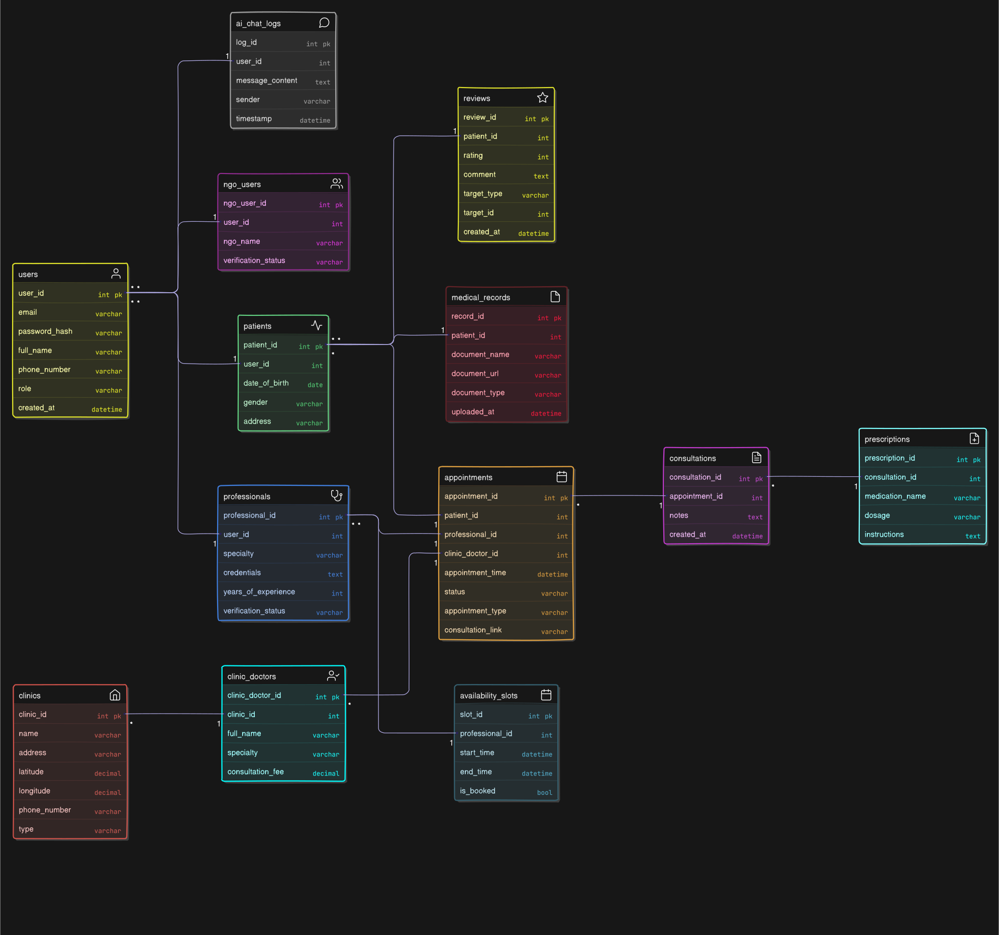
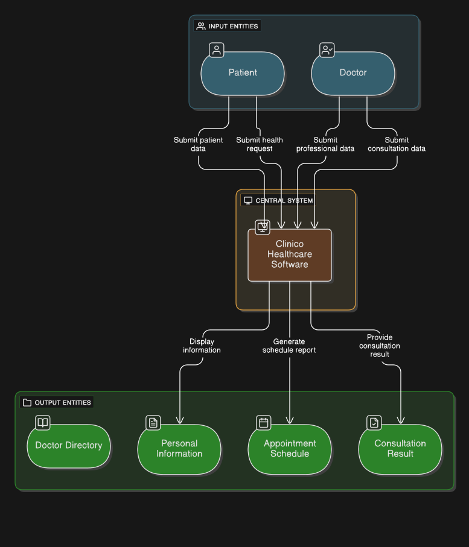
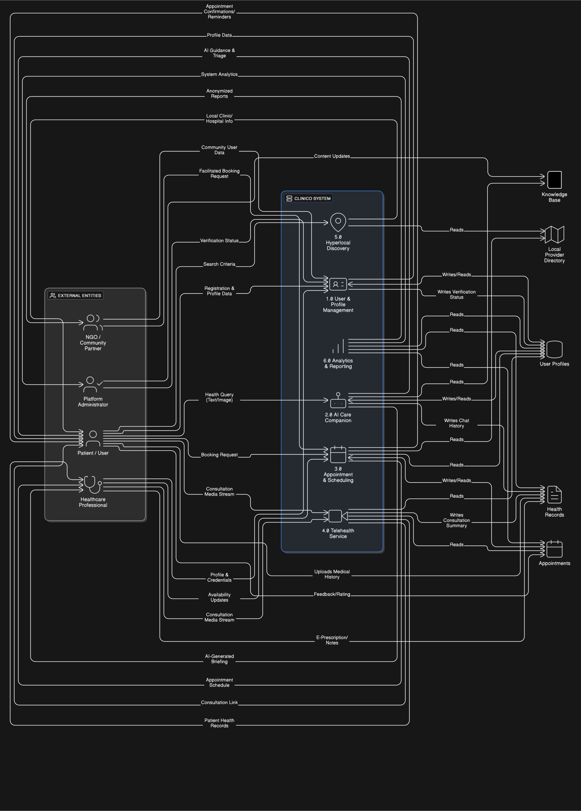

# Software Requirements Specification (SRS)
## Clinico: The Healing Hand Initiative  

**Document Information**  
- **Version:** 1.1  
- **Date:** September 2025  
- **Project Type:** Healthcare Platform with AI Integration  
- **Classification:** Confidential – Internal Use Only  
- **Review Cycle:** Quarterly  

---

## Table of Contents  

1. [Introduction](#1-introduction)  
    1.1. [Purpose](#11-purpose)  
    1.2. [Intended Audience](#12-intended-audience)  
    1.3. [Project Scope](#13-project-scope)  
    1.4. [Product Overview](#14-product-overview)  
    1.5. [Definitions, Acronyms, and Abbreviations](#15-definitions-acronyms-and-abbreviations)  

2. [Overall Description](#2-overall-description)  
    2.1. [Product Perspective](#21-product-perspective)  
        - 2.1.1. User Interface Layer  
        - 2.1.2. Application Layer  
        - 2.1.3. Data Layer  
        - 2.1.4. External Integrations  
    2.2. [Business Context Analysis](#22-business-context-analysis)  
        - 2.2.1. Problem Statement Alignment  
        - 2.2.2. Market Positioning  
    2.3. [User Classes and Characteristics](#23-user-classes-and-characteristics)  
        - 2.3.1. Primary User Profiles  
        - 2.3.2. User Journey Mapping  
    2.4. [Operating Environment](#24-operating-environment)  
        - 2.4.1. Technical Environment  
        - 2.4.2. Regulatory Environment  
    2.5. [Design and Implementation Constraints](#25-design-and-implementation-constraints)  
        - 2.5.1. Technical Constraints  
        - 2.5.2. Business Constraints  
    2.6. [Assumptions and Dependencies](#26-assumptions-and-dependencies)  
        - 2.6.1. Critical Assumptions  
        - 2.6.2. External Dependencies  

3. [System Features](#3-system-features)  
    - 3.1. Identity, Registration & Consent Management  
    - 3.2. AI Care Companion System  
    - 3.3. Appointment & Teleconsultation Management  
    - 3.4. Electronic Prescription & Care Management  
    - 3.5. Health Records & Communication Management  
    - 3.6. Hyperlocal Discovery System  
    - 3.7. Volunteer & Workforce Management  
    - 3.8. Administrative & Analytics Management  

4. [Non-Functional Requirements](#4-non-functional-requirements)  
    4.1. Performance Requirements  
        - 4.1.1. Response Time Requirements  
        - 4.1.2. Throughput Requirements  
        - 4.1.3. Scalability Requirements  
    4.2. Security & Privacy Requirements  
        - 4.2.1. Data Protection Standards  
        - 4.2.2. Access Control & Authentication  
        - 4.2.3. Privacy & Compliance  
    4.3. Usability & Accessibility Requirements  
        - 4.3.1. User Experience Standards  
        - 4.3.2. Accessibility Compliance  
        - 4.3.3. Multilingual Support  
    4.4. Reliability & Availability Requirements  
        - 4.4.1. System Availability  
        - 4.4.2. Data Integrity & Backup  
        - 4.4.3. Error Handling & Recovery  
    4.5. Compatibility & Integration Requirements  
        - 4.5.1. Platform Compatibility  
        - 4.5.2. Third-Party Integration Standards  

5. [Database Design](#5-database-design)  
    - 5.1. Data Architecture Overview  
        - 5.1.1. Database Components  
    - 5.2. Entity Relationship Design  
        - 5.2.1. Core Entity Groups  
    - 5.3. Data Relationships and Constraints  
        - 5.3.1. Key Relationships  
        - 5.3.2. Data Integrity Rules  
    - 5.4. Performance Optimization  
        - 5.4.1. Indexing Strategy  
        - 5.4.2. Partitioning Strategy  

6. [System Architecture](#6-system-architecture)  
    - 6.1. Architectural Overview  
        - 6.1.1. Architectural Principles  
    - 6.2. Service Architecture  
        - 6.2.1. Core Services  
    - 6.3. Data Flow Architecture  
        - 6.3.1. Request Processing Flow  
        - 6.3.2. Event-Driven Communication  
        - 6.3.3. Data Flow Diagrams  
    - 6.4. 6.4. Infrastructure Architecture  
        - 6.4.1. Cloud Infrastructure  
        - 6.4.2. Security Architecture  
        - 6.4.3. External Integrations  
        - 6.4.4. Project Source & Documentation 

7. [Appendices](#7-appendices)  
    - 7.1. Use Case Documentation  
    - 7.2. Use Case Traceability Matrix  
    - 7.3. Technology Stack Specifications  
        - 7.3.1. Frontend Technologies  
        - 7.3.2. Backend Technologies  
        - 7.3.3. Data & Infrastructure  
    - 7.4. Compliance & Regulatory Considerations  
        - 7.4.1. Healthcare Regulations  
        - 7.4.2. Data Protection Compliance  

8. [References](#8-references)  
    - 8.1. Project Foundation References  
    - 8.2. Technical Literature References  
    - 8.3. Healthcare Technology Standards  
    - 8.4. AI and Machine Learning References  
    - 8.5. Regulatory and Compliance Standards  
    - 8.6. Technology Stack Documentation  
    - 8.7. Industry Standards and Best Practices  


## 1. Introduction  

Clinico: *The Healing Hand Initiative* is an AI-powered healthcare platform that connects underserved communities with volunteer professionals through telemedicine, mental wellness support, and secure health records. By uniting advanced AI, hyperlocal provider discovery, and a volunteer network, it makes quality physical and mental healthcare accessible, affordable, and stigma-free.  

---

### 1.1 Purpose  
This Software Requirements Specification (SRS) document serves as the authoritative reference for all functional and non-functional requirements for Clinico: The Healing Hand Initiative. It defines the comprehensive healthcare platform that addresses the critical gap between physical and mental healthcare accessibility through innovative technology and structured volunteer expertise.  

---

### 1.2 Intended Audience  
**Primary Stakeholders:**  
- **Development Teams:** Software architects, developers, and QA engineers  
- **Project Management:** Project managers, product owners, and technical leads  
- **Healthcare Professionals:** Medical advisors and volunteer coordinators  
- **Business Stakeholders:** Investors, NGO partners, and regulatory consultants  
- **End Users:** Patient representatives and community health workers  

---

### 1.3 Project Scope  

#### Platform Capabilities  
- Unified healthcare ecosystem connecting patients with volunteer professionals  
- Multi-agent AI system providing 24/7 health assistance and mental wellness support  
- Hyperlocal discovery engine for physical healthcare providers  
- Comprehensive health record management with e-prescription capabilities  
- Community health facilitation through structured NGO partnerships  

#### Scope Boundaries  
- **Included:** Telemedicine platform, AI health assistance, appointment management, secure messaging  
- **Excluded:** Direct medical device integration, payment processing (third-party), physical infrastructure management  
- **Future Considerations:** IoT health device integration, advanced analytics dashboard, international expansion  

---

### 1.4 Product Overview  
Clinico addresses the fragmented healthcare landscape by creating a unified platform that:  
- Bridges the accessibility gap between urban and rural healthcare  
- Combines scalable AI technology with empathetic human expertise  
- Reduces healthcare costs through a volunteer-driven professional network  
- Eliminates stigma barriers in mental health support  
- Provides a structured framework for community health initiatives  

---

### 1.5 Definitions, Acronyms, and Abbreviations  

| Term  | Definition |
|-------|------------|
| **AI**  | Artificial Intelligence |
| **ASHA** | Accredited Social Health Activist |
| **CHW** | Community Health Worker |
| **EHR** | Electronic Health Records |
| **IVR** | Interactive Voice Response |
| **MCP** | Multi-Criteria Personalization |
| **NGO** | Non-Governmental Organization |
| **OTP** | One-Time Password |
| **RAG** | Retrieval-Augmented Generation |
| **SRS** | Software Requirements Specification |
| **UVP** | Unique Value Proposition |
| **WCAG** | Web Content Accessibility Guidelines |

---

## 2. Overall Description  

### 2.1 Product Perspective  
Clinico operates as a comprehensive healthcare ecosystem with four primary components:  

#### 2.1.1 User Interface Layer  
- **Mobile Applications:** Native iOS and Android apps for patients and Community Health Workers (CHWs)  
- **Web Dashboard:** Professional interface for healthcare providers and administrators  
- **Admin Console:** System management and monitoring interface  

#### 2.1.2 Application Layer  
- **AI Engine:** Google Gemini Pro with Vertex AI integration  
- **Backend Services:** Node.js with Express framework  
- **Mobile Applications:** Flutter for cross-platform development  
- **Web Dashboard:** React for professional interfaces  
- **Database:** PostgreSQL with Firebase for real-time features  

#### 2.1.3 Data Layer  
- **Primary Database:** PostgreSQL for transactional data  
- **Vector Database:** AI knowledge base and semantic search  
- **File Storage:** Medical documents and multimedia content  
- **Cache Layer:** Redis for performance optimization  

#### 2.1.4 External Integrations  
- **Communication:** Video calling, SMS services  
- **Payments:** Gateway integrations  
- **Location Services:** Google Maps API and geocoding services  
- **Cloud Infrastructure:** GCP / Google Cloud for scalability  

---

### 2.2 Business Context Analysis  

#### 2.2.1 Problem Statement Alignment  
The platform directly addresses identified healthcare accessibility challenges:  
- **Financial Barriers:** Freemium model with volunteer-driven cost reduction  
- **Infrastructure Gaps:** Technology-enabled remote consultation capabilities  
- **Professional Shortages:** Structured volunteer network with efficient matching  
- **Fragmented Systems:** Unified platform for physical and mental health needs  

#### 2.2.2 Market Positioning  
- **Target Market Size:** 500M+ underserved individuals in target regions  
- **Competitive Differentiation:** AI-human hybrid approach with volunteer focus  
- **Value Proposition:** Comprehensive care accessibility at affordable cost points  
- **Revenue Model:** Sustainable through freemium, partnerships, and grants  

---

### 2.3 User Classes and Characteristics  

#### 2.3.1 Primary User Profiles  

| **User Class**           | **Characteristics**                   | **Technical Proficiency** | **Primary Needs**                                   |
|--------------------------|--------------------------------------|--------------------------|----------------------------------------------------|
| Patients                 | Diverse demographics, limited healthcare access | Low to Medium           | Affordable care, easy booking, multilingual support |
| Healthcare Professionals | Licensed volunteers, time-constrained  | Medium to High           | Efficient tools, patient history access, impact tracking |
| Community Health Workers | Field workers, digital intermediaries  | Low to Medium            | Simple interfaces, multi-patient management         |
| Administrators           | Platform managers, quality overseers   | High                     | Comprehensive dashboards, user management, analytics|
| NGO Partners             | Community organizations, outreach focused | Medium                 | Impact reporting, community management tools        |

#### 2.3.2 User Journey Mapping  
- **Patient Onboarding:** Registration → AI interaction → Professional matching → Consultation  
- **Professional Onboarding:** Verification → Profile setup → Availability management → Patient care  
- **CHW Workflow:** Training → Patient advocacy → Appointment facilitation → Follow-up support  

---

### 2.4 Operating Environment  

#### 2.4.1 Technical Environment  
- **Client Platforms:** iOS 13+, Android 8+, modern web browsers  
- **Network Requirements:** 2G/3G compatible with adaptive quality  
- **Device Specifications:** Minimum 2GB RAM, camera, and microphone access  
- **Server Infrastructure:** Cloud-native, auto-scaling architecture  

#### 2.4.2 Regulatory Environment  
- **Healthcare Compliance:** Regional telemedicine regulations  
- **Data Protection:** GDPR-equivalent privacy standards  
- **Professional Standards:** Medical licensing verification requirements  
- **Quality Assurance:** Clinical supervision and audit protocols  

---

### 2.5 Design and Implementation Constraints  

#### 2.5.1 Technical Constraints  
- **Performance:** Sub-3-second response times on low-bandwidth networks  
- **Security:** End-to-end encryption for all health data  
- **Scalability:** Support for 100K+ concurrent users  
- **Reliability:** 99.9% uptime with disaster recovery capabilities  

#### 2.5.2 Business Constraints  
- **Budget:** Development within allocated resource constraints  
- **Timeline:** Phased deployment over an 18-month development cycle  
- **Regulatory:** Compliance with healthcare and data protection regulations  
- **Partnership:** Dependency on volunteer recruitment and NGO collaborations  

---

### 2.6 Assumptions and Dependencies  

#### 2.6.1 Critical Assumptions  
- Healthcare professionals maintain consistent volunteer participation  
- Target user populations have basic smartphone access and connectivity  
- Regulatory frameworks remain stable during the development period  
- AI technology capabilities continue advancing for health applications  

#### 2.6.2 External Dependencies  
- **Third-party Services:** Video calling, payment processing, and mapping services  
- **Infrastructure:** Cloud platform availability and performance  
- **Content:** Medical knowledge base accuracy and currency  
- **Partnerships:** NGO collaboration and community access facilitation  

---
## 3. System Features  

### 3.1 Identity, Registration & Consent Management  
**Priority:** High | **Risk:** Medium | **Complexity:** Medium  

#### 3.1.1 Feature Description  
Comprehensive user identity management system supporting multiple user types with robust consent tracking and privacy controls.  

---

#### 3.1.2 Functional Requirements  

##### **FR-1.1 Multi-Channel User Registration**  
- **Requirement:** System shall support OTP-based registration via mobile number  
- **Rationale:** Ensures accessibility for users without email access  
- **Acceptance Criteria:**  
  - OTP delivery within **30 seconds**  
  - Support for **10+ regional languages** during registration  
  - Role selection options: *Patient*, *Professional*, *NGO*, *Admin*  
  - Profile completion wizard with progress tracking  

---

##### **FR-1.2 Secure Authentication System**  
- **Requirement:** System shall implement multi-layered authentication  
- **Rationale:** Protects sensitive healthcare data and user privacy  
- **Acceptance Criteria:**  
  - OTP-based login for all user types  
  - Role-Based Access Control (RBAC) implementation  
  - Session management with configurable timeout  
  - Failed attempt lockout mechanism  

---

##### **FR-1.3 Dynamic Consent Management**  
- **Requirement:** System shall provide granular consent controls  
- **Rationale:** Ensures compliance with privacy regulations and user autonomy  
- **Acceptance Criteria:**  
  - Consent collection for data processing, sharing, and analytics  
  - Consent withdrawal capability with **immediate effect**  
  - Audit trail for all consent actions with **timestamps**  
  - Regular consent renewal prompts  

---
### 3.2 AI Care Companion System  
**Priority:** High | **Risk:** High | **Complexity:** High  

#### 3.2.1 Feature Description  
Advanced multi-agent AI system serving as the intelligent front door to healthcare services, providing personalized health guidance and mental wellness support.  

---

#### 3.2.2 Functional Requirements  

##### **FR-2.1 Multi-Agent Architecture**  
- **Requirement:** System shall implement a specialized AI agent framework  
- **Rationale:** Enables focused expertise and improved response quality  
- **Agent Specifications:**  
  - **AI Orchestrator & Personalization Engine:** Central coordination with MCP framework  
  - **Mental Wellness Agent:** 24/7 empathetic support with crisis intervention  
  - **Health Inquiry Agent:** RAG-powered medical information with source citations  
  - **Care Coordinator Agent:** Professional matching and pre-consultation briefings  
  - **Resource & Knowledge Agent:** Vector database search and retrieval  
  - **User Profile & Personalization Agent:** Dynamic user profiling and memory  
  - **Analytics & Insight Agent:** Trend analysis and platform insights  

---

##### **FR-2.2 Retrieval-Augmented Generation Engine**  
- **Requirement:** System shall generate responses using a trusted knowledge base  
- **Rationale:** Ensures accuracy and reduces AI hallucinations  
- **Acceptance Criteria:**  
  - Response generation based on verified medical content  
  - Source citation for all medical information  
  - Confidence scoring for response quality  
  - Regular knowledge base updates and validation  

---

##### **FR-2.3 Mental Wellness Support System**  
- **Requirement:** System shall provide comprehensive mental health assistance  
- **Rationale:** Addresses the mental health accessibility gap  
- **Acceptance Criteria:**  
  - 24/7 conversational support with empathetic responses  
  - Guided self-help exercises (e.g., mindfulness, CBT techniques)  
  - Mood and activity journaling with trend analysis  
  - Crisis intervention protocol with immediate resource provision  
  - Professional referral triggers based on conversation analysis  

---

##### **FR-2.4 Personalization Engine**  
- **Requirement:** System shall deliver personalized health experiences  
- **Rationale:** Improves engagement and health outcomes  
- **Acceptance Criteria:**  
  - Multi-criteria personalization (MCP) framework implementation  
  - Dynamic user profile updates based on interactions  
  - Proactive health nudges and customized content recommendations  
  - Learning algorithm for preference optimization  

---

### 3.3 Appointment & Teleconsultation Management  
**Priority:** High | **Risk:** Medium | **Complexity:** High  

#### 3.3.1 Feature Description  
Comprehensive appointment scheduling and teleconsultation platform supporting both virtual and in-person healthcare delivery.  

---

#### 3.3.2 Functional Requirements  

##### **FR-3.1 Intelligent Appointment Booking**  
- **Requirement:** System shall provide streamlined appointment management  
- **Rationale:** Reduces friction in healthcare access  
- **Acceptance Criteria:**  
  - Calendar-based booking interface with availability display  
  - Multi-timezone support for professional scheduling  
  - Appointment modification (reschedule/cancel) with notification system  
  - Automated reminders via SMS, email, and in-app notifications  
  - Group appointment scheduling for community health sessions  

---

##### **FR-3.2 Multi-Modal Consultation Platform**  
- **Requirement:** System shall support diverse consultation methods  
- **Rationale:** Accommodates varying user preferences and connectivity  
- **Acceptance Criteria:**  
  - High-quality video calling with bandwidth adaptation  
  - Audio-only consultation option  
  - Text-based chat for asynchronous communication  
  - IVR fallback system for low-connectivity areas  
  - Screen sharing for document review  
  - Consultation recording (with consent) for quality assurance  

---

##### **FR-3.3 Professional Availability Management**  
- **Requirement:** System shall optimize professional schedule coordination  
- **Rationale:** Maximizes volunteer time utilization  
- **Acceptance Criteria:**  
  - Flexible availability slot configuration and recurring schedule templates  
  - Multi-device synchronization  
  - Overbooking prevention mechanisms  
  - Emergency slot allocation for urgent cases  

---
### 3.4 Electronic Prescription & Care Management  
**Priority:** High | **Risk:** Medium | **Complexity:** Medium  

#### 3.4.1 Feature Description  
Comprehensive digital prescription system with integrated medication management and care plan tracking.  

---

#### 3.4.2 Functional Requirements  

##### **FR-4.1 Digital Prescription System**  
- **Requirement:** System shall provide secure e-prescription capabilities  
- **Rationale:** Enables complete digital healthcare workflow  
- **Acceptance Criteria:**  
  - Streamlined prescription creation with drug interaction checking  
  - Digital signature integration for legal compliance  
  - Multi-format prescription export (PDF, print-ready)  
  - Pharmacy integration for direct medication ordering  
  - Prescription history tracking and renewal management  

---

##### **FR-4.2 Medication Adherence System**  
- **Requirement:** System shall support medication compliance monitoring  
- **Rationale:** Improves treatment outcomes and patient safety  
- **Acceptance Criteria:**  
  - Customizable medication reminder schedules  
  - Adherence tracking with visual progress indicators  
  - Side effect reporting and monitoring  
  - Drug interaction alerts and warnings  
  - Family member notification options for critical medications  

---

### 3.5 Health Records & Communication Management  
**Priority:** High | **Risk:** Medium | **Complexity:** Medium  

#### 3.5.1 Feature Description  
Secure health record management system with an integrated communication platform for continuous care coordination.  

---

#### 3.5.2 Functional Requirements  

##### **FR-5.1 EHR-Lite System**  
- **Requirement:** System shall maintain comprehensive health records  
- **Rationale:** Enables continuity of care and informed decision-making  
- **Acceptance Criteria:**  
  - Timeline view of medical interactions and consultations  
  - Secure document upload with format support (PDF, images, lab reports)  
  - Medical history categorization and search functionality  
  - Data export capabilities for external healthcare providers  
  - Version control for document updates and modifications  

---

##### **FR-5.2 Secure Communication Platform**  
- **Requirement:** System shall provide encrypted messaging capabilities  
- **Rationale:** Ensures secure and compliant healthcare communication  
- **Acceptance Criteria:**  
  - End-to-end encrypted chat functionality  
  - File sharing with size and format restrictions  
  - Message status tracking (sent, delivered, read)  
  - Professional–patient communication threads  
  - Automated message archival and retention policies  

---
### 3.6 Hyperlocal Discovery System  
**Priority:** Medium | **Risk:** Low | **Complexity:** Medium  

#### 3.6.1 Feature Description  
Location-based healthcare provider discovery system with comprehensive filtering and booking integration.  

---

#### 3.6.2 Functional Requirements  

##### **FR-6.1 Interactive Map Interface**  
- **Requirement:** System shall provide location-based provider search  
- **Rationale:** Connects users with nearby healthcare options  
- **Acceptance Criteria:**  
  - Real-time location-based healthcare provider mapping  
  - Color-coded categorization (clinics, hospitals, specialists)  
  - Intelligent clustering for high-density areas  
  - Quick-view information cards with essential details  
  - Driving directions integration with popular navigation apps  

---

##### **FR-6.2 Advanced Filtering System**  
- **Requirement:** System shall enable precise provider search  
- **Rationale:** Helps users find the most suitable healthcare options  
- **Acceptance Criteria:**  
  - Multi-criteria filtering (specialty, distance, rating, price, availability)  
  - Insurance acceptance verification  
  - Language preference matching  
  - Accessibility feature indicators  
  - Real-time availability status  

---

### 3.7 Volunteer & Workforce Management  
**Priority:** High | **Risk:** Medium | **Complexity:** Medium  

#### 3.7.1 Feature Description  
Comprehensive system for recruiting, verifying, and managing volunteer healthcare professionals with quality assurance mechanisms.  

---

#### 3.7.2 Functional Requirements  

##### **FR-7.1 Professional Onboarding System**  
- **Requirement:** System shall verify and onboard healthcare professionals  
- **Rationale:** Ensures quality and credibility of the volunteer network  
- **Acceptance Criteria:**  
  - Multi-step credential verification process  
  - License validation with regulatory body integration  
  - Background check coordination and tracking  
  - Professional profile creation with specialty certification  
  - Ongoing credential monitoring and renewal alerts  

---

##### **FR-7.2 Quality Management System**  
- **Requirement:** System shall monitor and improve service quality  
- **Rationale:** Maintains high standards of volunteer healthcare delivery  
- **Acceptance Criteria:**  
  - Consultation quality scoring and feedback collection  
  - Peer review system for complex cases  
  - Professional development tracking and recommendations  
  - Escalation procedures for quality concerns  
  - Impact measurement and volunteer recognition programs  

---

### 3.8 Administrative & Analytics Management  
**Priority:** Medium | **Risk:** Low | **Complexity:** Medium  

#### 3.8.1 Feature Description  
Comprehensive administrative dashboard with advanced analytics for platform management and optimization.  

---

#### Functional Requirements  

##### **FR-8.1 Administrative Control Panel**  
- **Requirement:** System shall provide comprehensive platform management  
- **Rationale:** Enables efficient system administration and oversight  
- **Acceptance Criteria:**  
  - User management with role-based permissions  
  - Content management system for health resources  
  - System configuration and feature flag management  
  - Audit log review and compliance reporting  
  - Bulk operations for user and data management  

---

##### **FR-8.2 Advanced Analytics Dashboard**  
- **Requirement:** System shall provide actionable insights and reporting  
- **Rationale:** Supports data-driven platform improvements  
- **Acceptance Criteria:**  
  - Real-time usage metrics and performance indicators  
  - Health outcome tracking and trend analysis  
  - Volunteer engagement and impact measurement  
  - Community health reporting for NGO partners  
  - Predictive analytics for resource allocation  

---
## 4. Non-Functional Requirements  

### 4.1 Performance Requirements  

#### 4.1.1 Response Time Requirements  

| **User Action**          | **Target Response Time** | **Measurement Method**      |
|--------------------------|-------------------------|-----------------------------|
| Page/Screen Loading       | < 2 seconds             | 95th percentile             |
| AI Response Generation    | < 5 seconds             | Average response time       |
| Video Call Establishment  | < 10 seconds            | Connection success rate     |
| Search Results            | < 1 second              | Query completion time       |
| File Upload (10MB file)   | < 30 seconds            | Upload completion time      |

---

#### 4.1.2 Throughput Requirements  
- **Concurrent Users:** 10,000 simultaneous active users  
- **Video Consultations:** 1,000 simultaneous calls  
- **AI Query Processing:** 50,000 queries per hour  
- **Database Transactions:** 10,000 TPS during peak hours  
- **File Storage Operations:** 1,000 uploads per minute  

---

#### 4.1.3 Scalability Requirements  
- **Horizontal Scaling:** Auto-scaling based on CPU/memory utilization  
- **Database Scaling:** Read replica support with eventual consistency  
- **CDN Integration:** Global content delivery for multimedia assets  
- **Load Balancing:** Geographic and intelligent routing  
- **Resource Optimization:** Containerized microservices architecture  

---

### 4.2 Security & Privacy Requirements  

#### 4.2.1 Data Protection Standards  
- **Encryption:** AES-256 encryption for data at rest, TLS 1.3 for data in transit  
- **Key Management:** Hardware security module (HSM) for encryption key storage  
- **Data Classification:** Sensitive health data identification and protection  
- **Data Retention:** Automated data lifecycle management and purging  
- **Backup Security:** Encrypted backups with geo-distributed storage  

---

#### 4.2.2 Access Control & Authentication  
- **Multi-Factor Authentication:** Mandatory for healthcare professionals  
- **Role-Based Access Control (RBAC):** Granular permissions based on user roles  
- **Session Management:** Secure token-based authentication with refresh mechanisms  
- **API Security:** OAuth 2.0 with JWT tokens for API access  
- **Audit Logging:** Comprehensive logging of all security-relevant events  

---

#### 4.2.3 Privacy & Compliance  
- **Data Minimization:** Collection of only necessary personal information  
- **Consent Management:** Granular consent with easy withdrawal mechanisms  
- **Right to be Forgotten:** Complete data deletion capabilities  
- **Cross-Border Transfer:** Privacy shield compliance for international operations  
- **Regular Audits:** Quarterly security assessments and penetration testing  

---
### 4.3 Usability & Accessibility Requirements  

#### 4.3.1 User Experience Standards  
- **Intuitive Navigation:** Maximum 3-click access to primary functions  
- **Responsive Design:** Consistent experience across devices and screen sizes  
- **Loading Indicators:** Clear feedback for all system operations  
- **Error Handling:** User-friendly error messages with suggested actions  
- **Help System:** Contextual help and guided tutorials  

---

#### 4.3.2 Accessibility Compliance  
- **WCAG 2.1 AA Compliance:** Full accessibility standard adherence  
- **Screen Reader Support:** Compatible with popular assistive technologies  
- **Keyboard Navigation:** Complete functionality without mouse/touch  
- **High Contrast Mode:** Visual accessibility for users with vision impairments  
- **Font Scaling:** Support for browser-based text size adjustments  

---

#### 4.3.3 Multilingual Support  
- **Language Coverage:** Support for 10+ regional languages  
- **RTL Support:** Right-to-left language compatibility  
- **Cultural Adaptation:** Region-specific content and imagery  
- **Translation Quality:** Professional translation and regular updates  
- **Language Switching:** Seamless language change without data loss  

---

### 4.4 Reliability & Availability Requirements  

#### 4.4.1 System Availability  
- **Uptime Target:** 99.9% availability (8.77 hours downtime per year)  
- **Maintenance Windows:** Maximum 2-hour monthly scheduled maintenance  
- **Geographic Distribution:** Multi-region deployment for disaster recovery  
- **Failover Time:** Automatic failover within 60 seconds  
- **Health Monitoring:** Continuous system health checks and alerting  

---

#### 4.4.2 Data Integrity & Backup  
- **Data Consistency:** ACID compliance for critical transactions  
- **Backup Frequency:** Continuous incremental backups with daily full backups  
- **Recovery Time Objective (RTO):** 4 hours maximum system restoration time  
- **Recovery Point Objective (RPO):** Maximum 15 minutes of data loss  
- **Disaster Recovery:** Automated disaster recovery with regular testing  

---

#### 4.4.3 Error Handling & Recovery  
- **Graceful Degradation:** Partial functionality maintenance during outages  
- **Error Logging:** Comprehensive error tracking and analysis  
- **Automatic Recovery:** Self-healing capabilities for common failure scenarios  
- **User Communication:** Transparent status communication during incidents  
- **Post-Incident Analysis:** Root cause analysis and improvement implementation  

---

### 4.5 Compatibility & Integration Requirements  

#### 4.5.1 Platform Compatibility  
- **Mobile Platforms:** iOS 13+ and Android 8+ with backward compatibility  
- **Web Browsers:** Chrome 90+, Firefox 88+, Safari 14+, Edge 90+  
- **Operating Systems:** Windows 10+, macOS 10.15+, major Linux distributions  
- **Device Requirements:** Minimum 2GB RAM, 100MB storage space  
- **Network Compatibility:** 2G/3G/4G/Wi-Fi with adaptive quality  

---

#### 4.5.2 Third-Party Integration Standards  
- **API Standards:** RESTful APIs with OpenAPI 3.0 specification  
- **Authentication:** OAuth 2.0 and API key authentication  
- **Data Formats:** JSON for API communications, standardized healthcare data formats  
- **Webhooks:** Real-time event notifications for external systems  
- **Rate Limiting:** Fair usage policies with configurable limits  

---
## 5. Database Design

### 5.1 Data Architecture Overview
The database architecture follows a hybrid approach combining relational and NoSQL databases to optimize for both transactional integrity and analytical performance.

#### 5.1.1 Database Components
- **Primary Database:** PostgreSQL 13+ for transactional data
- **Vector Database:** Pinecone/Weaviate for AI knowledge base and semantic search
- **Time-Series Database:** InfluxDB for metrics and monitoring data
- **Cache Layer:** Redis for session management and frequent access patterns
- **File Storage:** AWS S3 / Google Cloud Storage for multimedia content

---

### 5.2 Entity Relationship Design


#### 5.2.1 Core Entity Groups

### 1. Core User & Role Management

```sql

users (
    user_id UUID PRIMARY KEY,
    email VARCHAR(255) UNIQUE NOT NULL,
    password_hash VARCHAR(255) NOT NULL,
    full_name VARCHAR(255) NOT NULL,
    phone_number VARCHAR(20),
    role VARCHAR(50) NOT NULL, --'Patient', 'Professional', 'NGO'
    created_at TIMESTAMP DEFAULT NOW()
);

patients (
    patient_id UUID PRIMARY KEY,
    user_id UUID REFERENCES users(user_id) ON DELETE CASCADE,
    date_of_birth DATE,
    gender VARCHAR(20),
    address TEXT
);

professionals (
    professional_id UUID PRIMARY KEY,
    user_id UUID REFERENCES users(user_id) ON DELETE CASCADE,
    specialty VARCHAR(255),
    credentials TEXT,
    years_of_experience INTEGER,
    verification_status VARCHAR(20) DEFAULT 'Pending' -- 'Pending', 'Verified'
);

ngo_users (
    ngo_user_id UUID PRIMARY KEY,
    user_id UUID REFERENCES users(user_id) ON DELETE CASCADE,
    ngo_name VARCHAR(255),
    verification_status VARCHAR(20)
);

```

### 2. Appointment & Consultation Core

```sql 
appointments (
    appointment_id UUID PRIMARY KEY,
    patient_id UUID REFERENCES patients(patient_id),
    professional_id UUID REFERENCES professionals(professional_id), -- Nullable
    clinic_doctor_id UUID REFERENCES clinic_doctors(clinic_doctor_id), -- Nullable
    appointment_time TIMESTAMP NOT NULL,
    status VARCHAR(20) DEFAULT 'Scheduled', -- 'Scheduled', 'Completed', 'Cancelled'
    appointment_type VARCHAR(20) NOT NULL, -- 'Virtual', 'In-Person'
    consultation_link VARCHAR(500), -- Only for virtual appointments
    CONSTRAINT valid_provider CHECK (
        (professional_id IS NOT NULL) != (clinic_doctor_id IS NOT NULL)
    )
);

availability_slots (
    slot_id UUID PRIMARY KEY,
    professional_id UUID REFERENCES professionals(professional_id),
    start_time TIMESTAMP NOT NULL,
    end_time TIMESTAMP NOT NULL,
    is_booked BOOLEAN DEFAULT FALSE
);

consultations (
    consultation_id UUID PRIMARY KEY,
    appointment_id UUID REFERENCES appointments(appointment_id),
    notes TEXT
);

prescriptions (
    prescription_id UUID PRIMARY KEY,
    consultation_id UUID REFERENCES consultations(consultation_id),
    medication_name VARCHAR(255),
    dosage VARCHAR(100),
    instructions TEXT
);
```

### 3. Patient-Specific Data

```sql
medical_records (
    record_id UUID PRIMARY KEY,
    patient_id UUID REFERENCES patients(patient_id),
    document_name VARCHAR(255),
    document_url VARCHAR(500), -- Link to cloud storage
    document_type VARCHAR(100),
    uploaded_at TIMESTAMP DEFAULT NOW()
);
```

### 4. Hyperlocal Discovery System

```sql
clinics (
    clinic_id UUID PRIMARY KEY,
    name VARCHAR(255),
    address TEXT,
    latitude DECIMAL(10, 8),
    longitude DECIMAL(11, 8),
    phone_number VARCHAR(20),
    type VARCHAR(20) -- 'Clinic' or 'Hospital'
);

clinic_doctors (
    clinic_doctor_id UUID PRIMARY KEY,
    clinic_id UUID REFERENCES clinics(clinic_id),
    full_name VARCHAR(255),
    specialty VARCHAR(255),
    consultation_fee DECIMAL(10, 2)
);
```

### 5. Feedback & Interaction

```sql
clinic_doctors (
    clinic_doctor_id UUID PRIMARY KEY,
    clinic_id UUID REFERENCES clinics(clinic_id),
    full_name VARCHAR(255),
    specialty VARCHAR(255),
    consultation_fee DECIMAL(10, 2)
);

reviews (
    review_id UUID PRIMARY KEY,
    patient_id UUID REFERENCES patients(patient_id),
    rating INTEGER CHECK (rating BETWEEN 1 AND 5),
    comment TEXT,
    target_type VARCHAR(50), -- 'Appointment' or 'Clinic_Doctor'
    target_id UUID -- Polymorphic relationship
);

```

### 5.3. Data Relationships and Constraints

#### 5.3.1. Key Relationships
- **One-to-One**: `users` ↔ `patients` / `professionals` / `ngo_users`  
- **One-to-Many**: `patients` → `appointments`, `professionals` → `availability_slots`  
- **Many-to-Many**: `professionals` ↔ `specialties` (via junction table)  
- **Polymorphic**: `reviews` → `appointments` / `clinic_doctors` (via `target_type` / `target_id`)  

#### 5.3.2. Data Integrity Rules
- **Referential Integrity**: Foreign key constraints with appropriate `CASCADE` rules  
- **Business Logic Constraints**: Check constraints for valid data ranges and combinations  
- **Unique Constraints**: Email, phone numbers, and license numbers must be unique  
- **Audit Trail**: Created/updated timestamps on all major entities  

---

### 5.4. Performance Optimization

#### 5.4.1. Indexing Strategy
- **Primary Indexes**: UUID primary keys with B-tree indexes  
- **Composite Indexes**: Multi-column indexes for frequent query patterns  
- **Partial Indexes**: Filtered indexes for specific query optimizations  
- **Full-Text Indexes**: GIN indexes for search functionality  

#### 5.4.2. Partitioning Strategy
- **Time-Based Partitioning**: Appointments and consultations by date ranges  
- **Hash Partitioning**: User data distribution across multiple partitions  
- **List Partitioning**: Geographic-based data separation for compliance  

## 6. System Architecture

### 6.1. Architectural Overview
The system employs a **cloud-native microservices architecture** designed for **scalability**, **maintainability**, and **resilience**.

#### 6.1.1. Architectural Principles
- **Microservices**: Domain-driven service decomposition  
- **Event-Driven**: Asynchronous communication via message queues  
- **API-First**: Consistent RESTful API design across services  
- **Cloud-Native**: Container-based deployment with orchestration  
- **Security by Design**: Zero-trust security model implementation  

---

### 6.2. Service Architecture

#### 6.2.1. Core Services

| **Service**           | **Responsibility**                            | **Technology Stack**              | **Scaling Strategy**          |
|-----------------------|-----------------------------------------------|----------------------------------|------------------------------|
| **User Service**      | Authentication, OTP management, user profiles | Node.js, Express, JWT            | Horizontal, stateless        |
| **Appointment Service**| Booking, calendar, notifications              | Node.js, Firebase, PostgreSQL    | Event-driven scaling         |
| **AI Engine Service** | Multi-agent coordination, personalization     | Python, Google Gemini API, Vertex AI | GPU-based horizontal scaling |
| **Communication Service** | Video calls, messaging, real-time chat     | Node.js, WebRTC, Socket.io       | Connection-based scaling     |
| **Health Records Service**| EHR, document management, FHIR compliance  | Node.js, PostgreSQL, file storage | Data-partitioned scaling     |
| **NGO Partner Service**| Community management, impact tracking        | Node.js, PostgreSQL              | Tenant-based scaling         |


## 6.3. Data Flow Architecture

### 6.3.1. Request Processing Flow
- **Client Request** → API Gateway (authentication, rate limiting)  
- **Service Routing** → Load balancer → Target microservice  
- **Business Logic** → Service processes request with database interaction  
- **Event Publishing** → Asynchronous event notification to relevant services  
- **Response** → Formatted response returned through API gateway  

---

### 6.3.2. Event-Driven Communication
- **Event Bus**: Apache Kafka for high-throughput event streaming  
- **Message Queues**: Redis/RabbitMQ for task queuing and processing  
- **Event Sourcing**: Audit trail and state reconstruction capabilities  
- **CQRS Pattern**: Command and Query Responsibility Segregation for performance  

---

### 6.3.3. Data Flow Diagrams

#### **Level 0 DFD (Context Diagram)**  
  

The **Level 0** diagram provides a *bird's-eye view* of the entire Clinico system. It treats the application as a **single process (black box)**, showing only external entities and data flows to define the system's boundary.  

**Breakdown of Components**  
- **Central Process**: Clinico Healthcare Software  
  - Receives all incoming data, processes it using business logic, and generates outgoing information.  
- **Input Entities (Sources of Data)**:  
  - **Patient**: End-users of the mobile app providing personal and health data.  
  - **Doctor**: Verified healthcare professionals using the web dashboard.  
- **Input Data Flows**:  
  - Submit patient data (registration/profile updates)  
  - Submit health request (AI Companion query or doctor search)  
  - Submit professional data (doctor credentials and availability)  
  - Submit consultation data (clinical notes and prescriptions)  
- **Output Entities (Destinations of Data)**:  
  - Personal Information (user profile display)  
  - Doctor Directory (map/search result of local doctors)  
  - Appointment Schedule (view of upcoming appointments)  
  - Consultation Result (digital prescription or summary delivered to the patient)  

**Summary**:  
The **Level 0 diagram** shows Clinico as a system that receives data from **Patients** and **Doctors**, processes it, and produces **informational displays, reports, and consultation results**.

---

#### **Level 1 DFD**  


The **Level 1 DFD** expands the Level 0 diagram into major **sub-processes**, **data stores**, and **flows**.  

**External Entities**  
- Patient/User  
- Healthcare Professional  
- NGO/Community Partner  
- Platform Administrator  

**Main Processes (Functional Cores)**  
1. **User & Profile Management** – Handles registration, login, and profile updates for all user types.  
2. **AI Care Companion** – Processes health queries, interacts with the knowledge base, and provides guidance.  
3. **Appointment & Scheduling** – Manages booking, viewing, and managing appointments, including doctor availability.  
4. **Telehealth Service** – Manages live video consultations and generates post-consultation documents like notes and prescriptions.  
5. **Hyperlocal Discovery** – Handles searches for local clinics and doctors.  
6. **Analytics & Reporting** – Collects and analyzes data for admin and NGO insights.  

**Data Stores (System Memory)**  
- **User Profiles** – Stores all user account information.  
- **Health Records** – Holds patient-specific data like chat history, uploaded documents, and consultation summaries.  
- **Appointments** – Tracks scheduled, completed, and cancelled appointments.  
- **Knowledge Base** – Vetted medical information for the AI Companion (RAG model).  
- **Local Provider Directory** – Database of physical clinics and doctors for in-person booking.  

**Summary**:  
The **Level 1 DFD** opens the "black box" of Clinico to show **key functional areas**, **data stores**, and **flows**, providing a deeper understanding of how components interact internally.

## 6.4. Infrastructure Architecture

### 6.4.1. Cloud Infrastructure Architecture (Using App Engine)

The Clinico platform is built on a scalable, secure, and serverless foundation using **Google Cloud Platform (GCP)**. Our approach prioritizes rapid development and automated management by leveraging **Google App Engine**.

- **Compute Platform**: Google App Engine with a Flexible Environment  
  - **Description**: Our backend (Node.js) and AI (Python) microservices are packaged as standard Docker containers. We deploy these containers directly to App Engine. This provides a serverless experience where Google automatically manages the underlying infrastructure, scaling, and load balancing based on traffic, while still giving us the portability of Docker.  

- **Service Communication**: App Engine Services Discovery  
  - **Description**: Each microservice (e.g., *clinico-backend*, *clinico-ai-service*) is deployed as a separate "service" within the same App Engine application. This allows them to communicate with each other securely and efficiently over a private internal network using stable service URLs (e.g., `ai-service-dot-your-project-id.appspot.com`), without needing a complex service mesh like Istio.  

- **API Gateway**: Google Cloud Endpoints with App Engine integration  
  - **Description**: All incoming traffic from the Flutter app and React dashboard is routed through Cloud Endpoints. This provides a single, secure entry point for our system, handling authentication (JWT validation), rate limiting, and protection against common web threats before forwarding requests to the appropriate App Engine service.  

- **Monitoring & Logging**: Google Cloud's Operations Suite (Cloud Logging & Error Reporting)  
  - **Description**: App Engine is natively integrated with Cloud Logging and Error Reporting. All `console.log` outputs from our Node.js service and logs from our Python service are automatically collected, centralized, and searchable. Error Reporting automatically captures and alerts us on any application crashes.  

- **CI/CD Pipeline**: Google Cloud Build triggered by GitHub Webhooks  
  - **Description**: Our deployment process is fully automated. When new code is pushed to our main branch on GitHub, a webhook triggers a Cloud Build pipeline. This pipeline automatically runs tests, builds our Docker images, and deploys the new versions directly to our App Engine services with zero downtime using traffic splitting.  


---

### 6.4.2. Security Architecture  

Security is a foundational aspect of the Clinico platform, especially when handling sensitive health data.  

- **Network Security**: Google Cloud VPC, Firewall Rules, and Network Segmentation  
  - **Description**: Our services run within a custom Virtual Private Cloud (VPC), isolated from the public internet. Strict firewall rules ensure that services can only communicate on approved ports. The database is in a separate, private subnet with no direct internet access.  

- **Identity & Access Management**: Custom JWT Implementation with Role-Based Access Control (RBAC)  
  - **Description**: All authenticated API requests require a valid JSON Web Token (JWT). The backend validates the token's signature and uses the role claim (*Patient*, *Professional*, etc.) to enforce strict permissions, ensuring users can only access the data and actions they are authorized for.  

- **Secrets Management**: Google Secret Manager  
  - **Description**: All sensitive credentials, such as database passwords and API keys, are stored securely in Google Secret Manager. Our applications retrieve these secrets at runtime, meaning they are never hardcoded in our source code.  

- **Compliance Monitoring**: Automated Security Scanning  
  - **Description**: We use automated tools within our CI/CD pipeline to scan our Docker images for known vulnerabilities and our code for common security flaws before deployment.  

---

### 6.4.3. External Integrations  

The platform integrates with several best-in-class, managed third-party services to provide core functionalities:  

- **AI Engine**: Google Vertex AI for hosting and serving the Gemini models.  
- **Location Services**: Google Maps Platform API for hyperlocal search, mapping, and geolocation.  
- **Push Notifications**: Firebase Cloud Messaging (FCM) for sending real-time appointment reminders and alerts.  
- **Video Communication**: WebRTC for secure, peer-to-peer, real-time video and audio streaming during consultations.  


### 6.4.4. Project Source & Documentation  
- **Source Code Repository**: The complete source code for this project is open-source and hosted on GitHub  
  - **URL**: [https://github.com/abhay-byte/minor-project-gtbit](https://github.com/abhay-byte/minor-project-gtbit)  
  - **Open Source**: This project is licensed under the **MIT License**. We encourage contributions and collaboration from the community.  

- **Project Documentation**:  
  All planning, design, and architectural documents, including diagrams and API specifications, are maintained within the `/documentation` folder of the main repository.  


## 7. Appendices

### 7.1. Use Case Documentation
Based on the comprehensive use case analysis, the Clinico system supports **six primary use case groups**:

---

#### **Use Case Group 1: Identity, Registration & Consent Management**  
- **Actors**: Patient, Admin  
- **Key Use Cases**:  
  - Register/Login (via OTP)  
  - Consent Management (give/withdraw consent)  
  - Role-based Access  

---

#### **Use Case Group 2: Intake, Triage & Risk Management**  
- **Actors**: Patient, CHW, Doctor, Counsellor, Triage Engine  
- **Key Use Cases**:  
  - Symptom Intake (physical/mental)  
  - AI-Assisted Triage (human approval required)  
  - Crisis Workflow (suicidal/self-harm escalation)  

---

#### **Use Case Group 3: Scheduling & Teleconsultation Management**  
- **Actors**: Patient, Doctor, Counsellor  
- **Key Use Cases**:  
  - Appointment Booking (book, reschedule, cancel)  
  - Virtual Consult (video/audio/IVR fallback)  
  - E-Prescription & Care Plan  

---

#### **Use Case Group 4: Records, Messaging & Follow-Ups Management**  
- **Actors**: Patient, Doctor, Counsellor, CHW  
- **Key Use Cases**:  
  - EHR-lite Records (timeline of visits, screenings, prescriptions)  
  - Secure Messaging (encrypted chat)  
  - Reminders & Adherence (medication/therapy reminders)  

---

#### **Use Case Group 5: Volunteer & Workforce Management**  
- **Actors**: Admin, Volunteer Doctor, Counsellor  
- **Key Use Cases**:  
  - Volunteer Onboarding (license verification, availability)  
  - Quality & Supervision (case review, feedback, escalation)  

---

#### **Use Case Group 6: Admin, Audit & Analytics Management**  
- **Actors**: Admin, Partner (read-only)  
- **Key Use Cases**:  
  - Admin Console (manage users, roles, content)  
  - Metrics & Dashboards (utilization, referral outcomes)  
  - Audit Trails (tamper-proof logs, compliance reporting)  

## 7.2. Use Case Traceability Matrix

### Primary Use Case Traceability

| **Use Case ID** | **Use Case Name**                | **Related Functional Requirements** | **Priority** |
|-----------------|---------------------------------|------------------------------------|--------------|
| UC-1            | Patient Registration             | FR-1.1, FR-1.2, FR-1.3             | High         |
| UC-2            | AI Health Consultation           | FR-2.1, FR-2.2, FR-2.3, FR-2.4     | High         |
| UC-3            | Professional Appointment Booking | FR-3.1, FR-3.2, FR-3.3             | High         |
| UC-4            | Teleconsultation Session         | FR-3.2, FR-4.1, FR-5.2             | High         |
| UC-5            | Health Record Management         | FR-5.1, FR-5.3                     | Medium       |
| UC-6            | Local Provider Discovery         | FR-6.1, FR-6.2, FR-6.3             | Medium       |


---

### Detailed Use Case Traceability Matrix

| **Use Case ID** | **Use Case Name**                 | **Related Functional Requirements** | **Priority** | **Status** |
|-----------------|----------------------------------|------------------------------------|--------------|------------|
| UC-1.1          | Patient Registration via OTP      | FR-1.1, FR-1.2                     | High         | Defined    |
| UC-1.2          | Consent Management                | FR-1.3                             | High         | Defined    |
| UC-1.3          | Role-based System Access          | FR-1.2, FR-7.1                     | High         | Defined    |
| UC-2.1          | Symptom Intake Processing         | FR-2.3, FR-2.4                     | High         | Defined    |
| UC-2.2          | AI-Assisted Triage                | FR-2.1, FR-2.2                     | High         | Defined    |
| UC-2.3          | Crisis Intervention Workflow      | FR-2.3                             | Critical     | Defined    |
| UC-3.1          | Appointment Booking System        | FR-3.1, FR-3.3                     | High         | Defined    |
| UC-3.2          | Virtual Consultation Platform     | FR-3.2                             | High         | Defined    |
| UC-3.3          | E-Prescription Generation         | FR-4.1                             | High         | Defined    |
| UC-4.1          | EHR-lite Records Management       | FR-5.1                             | Medium       | Defined    |
| UC-4.2          | Secure Messaging System           | FR-5.2                             | High         | Defined    |
| UC-4.3          | Medication Adherence Tracking     | FR-4.2, FR-5.3                     | Medium       | Defined    |
| UC-5.1          | Volunteer Professional Onboarding | FR-7.1                             | High         | Defined    |
| UC-5.2          | Quality Assurance & Supervision   | FR-7.2                             | High         | Defined    |
| UC-6.1          | Administrative Console            | FR-8.1                             | Medium       | Defined    |
| UC-6.2          | Analytics Dashboard               | FR-8.2                             | Medium       | Defined    |
| UC-6.3          | Audit Trail Management            | FR-8.3                             | High         | Defined    |

---

## 7.3. Risk Assessment Matrix

| **Risk Category** | **Risk Description**            | **Impact** | **Probability** | **Mitigation Strategy**                                            |
|-------------------|---------------------------------|------------|----------------|--------------------------------------------------------------------|
| Technical         | AI model accuracy issues         | High       | Medium         | RAG implementation, human oversight, regular model updates         |
| Technical         | Third-party service dependencies | Medium     | High           | Multi-vendor strategy, fallback mechanisms, SLA agreements         |
| Regulatory        | Healthcare compliance violations | High       | Low            | Legal consultation, compliance audits, regulatory monitoring       |
| Business          | Volunteer professional retention | High       | Medium         | Engagement programs, recognition systems, impact tracking          |
| Security          | Healthcare data breach           | Critical    | Low            | Multi-layer security, encryption, regular security audits          |
| Operational       | Scalability bottlenecks          | Medium     | Medium         | Load testing, auto-scaling, performance monitoring                 |
     |

## 7.3. Clinico Technology Stack

### 7.3.1. Frontend Technologies
- **Mobile Development**: Flutter 3+ with Dart  
  *Reasoning*: A single codebase for both Android and iOS ensures rapid development and consistent user experience.  

- **Web Application**: React 18+ (using Create React App)  
  *Reasoning*: A powerful and widely-adopted library for building dynamic, single-page applications for the professional-facing dashboard.  

- **State Management**: Bloc or Provider for Flutter; Redux Toolkit with RTK Query for React  
  *Reasoning*: Robust and scalable state management solutions tailored for each framework.  

- **UI Components**: Material You (for Flutter); Material-UI (MUI) for React  
  *Reasoning*: Provides a consistent, modern, and accessible design system across both platforms.  

- **Testing**: Flutter Test (Widget, Integration); Jest & React Testing Library for the web dashboard  
  *Reasoning*: Comprehensive testing frameworks to ensure code quality and reliability.  

---

### 7.3.2. Backend Technologies
- **API Services**: Node.js 18+ with Express.js framework  
  *Reasoning*: Excellent for handling real-time, I/O-heavy operations like chat, video signaling, and API requests.  

- **AI Services**: Python 3.9+ with Flask framework  
  *Reasoning*: The industry standard for AI/ML workloads. Flask is a lightweight and flexible framework, perfect for creating the AI agent microservice API.  

- **AI Engine**: Google Gemini Pro / Pro Vision via Vertex AI  
  *Reasoning*: Provides state-of-the-art multimodal (text and image) reasoning capabilities for the AI Care Companion.  

- **Authentication**: Custom JWT (JSON Web Token) implementation  
  *Reasoning*: A stateless, secure, and standard method for authenticating users across the mobile and web clients.  

- **API Documentation**: OpenAPI 3.0 with Swagger UI  
  *Reasoning*: Creates a clear, interactive contract for the frontend team to understand and test API endpoints.  

- **Testing**: Jest & Supertest for Node.js services; PyTest for Python services  
  *Reasoning*: Ensures the reliability and correctness of the backend logic.  

---

### 7.3.3. Data & Infrastructure
- **Primary Database**: PostgreSQL 13+  
  *Reasoning*: A robust, reliable, and highly scalable open-source relational database perfect for storing user and application data.  

- **Vector Database**: Pinecone or Vertex AI Search  
  *Reasoning*: A specialized database optimized for the high-speed semantic search required by the AI's RAG knowledge base.  

- **Cache**: Redis 6+  
  *Reasoning*: For session management, caching frequently accessed data, and reducing database load.  

- **Message Queue / Push Notifications**: Firebase Cloud Messaging (FCM)  
  *Reasoning*: A reliable, cross-platform solution for sending real-time appointment reminders and other critical notifications.  

- **Cloud Platform**: Google Cloud Platform (GCP) or Amazon Web Services (AWS)  
  *Reasoning*: Provides all the necessary managed services for a scalable and secure deployment.  

- **Container Platform**: Docker deployed on Google App Engine or AWS App Runner  
  *Reasoning*: This approach combines the simplicity of a managed platform-as-a-service (like App Engine) with the portability and consistency of Docker containers. It handles auto-scaling and networking automatically, simplifying deployment while maintaining a microservice architecture.  

### 7.3.1. Frontend Technologies
- **Mobile Development**: React Native 0.72+ with TypeScript  
- **Web Application**: React 18+ with Next.js framework  
- **State Management**: Redux Toolkit with RTK Query  
- **UI Components**: Material-UI / React Native Elements  
- **Testing**: Jest, React Testing Library, Detox (for mobile)  

---

### 7.3.2. Backend Technologies
- **API Services**: Node.js 18+ with Express.js framework  
- **AI Services**: Python 3.9+ with FastAPI framework  
- **Authentication**: Auth0 or custom JWT implementation  
- **API Documentation**: OpenAPI 3.0 with Swagger UI  
- **Testing**: Jest, Supertest, PyTest (for Python services)  

---

### 7.3.3. Data & Infrastructure
- **Primary Database**: PostgreSQL 13+ with TimescaleDB extension  
- **Vector Database**: Pinecone or Weaviate for AI embeddings  
- **Cache**: Redis 6+ for session management and caching  
- **Message Queue**: Firebase for event streaming  
- **Cloud Platform**: AWS or Google Cloud Platform  
- **Container Platform**: Docker with Kubernetes orchestration  

---

## 7.4. Compliance & Regulatory Considerations

### 7.4.1. Healthcare Regulations
- **Telemedicine Licensing**: Compliance with regional telemedicine laws  
- **Medical Device Regulations**: Software as Medical Device (SaMD) considerations  
- **Professional Standards**: Healthcare professional licensing verification  
- **Clinical Guidelines**: Evidence-based medical content standards  

---

### 7.4.2. Data Protection Compliance
- **GDPR Compliance**: Adherence to European data protection regulations  
- **HIPAA Equivalent**: Regional healthcare data protection standards  
- **Data Localization**: Regional data residency requirements  
- **Cross-Border Transfer**: Privacy shield and adequacy decisions  

## 8. References

### 8.1. Project Foundation References
#### 8.1.1. UNICEF Problem Statement Reference  
- **UNICEF**. (2024). *Healthcare Access and Digital Innovation Challenges in Underserved Communities.* UNICEF Innovation Lab Problem Statement Initiative. Retrieved September 2024 from [https://www.unicef.org/innovation/](https://www.unicef.org/innovation/)  
> *Note: Replace with your specific UNICEF source URL and exact title.*

---

### 8.2. Technical Literature References
#### 8.2.1. Software Engineering Foundations  
- Aggarwal, K. K., & Singh, Y. (2005). *Software Engineering* (3rd ed.). New Age International.  
- Pressman, R. S. (2001). *Software Engineering: A Practitioner's Approach* (5th ed.). McGraw Hill International.  
- Jalote, P. (2005). *An Integrated Approach to Software Engineering* (3rd ed.). Narosa Publishing.  

---

### 8.3. Healthcare Technology Standards
#### 8.3.1. Digital Health Guidelines  
- World Health Organization. (2019). *WHO Guideline: Recommendations on Digital Interventions for Health System Strengthening.* Geneva: World Health Organization.  
- HL7 International. (2020). *Fast Healthcare Interoperability Resources (FHIR) R4 Implementation Guide.* Retrieved from [https://hl7.org/fhir/](https://hl7.org/fhir/)  

---

### 8.4. AI and Machine Learning References
#### 8.4.1. Healthcare AI Applications  
- Topol, E. J. (2019). *High-performance medicine: The convergence of human and artificial intelligence.* *Nature Medicine*, 25(1), 44–56.  
- Google Cloud. (2024). *Vertex AI Documentation and Best Practices.* Retrieved September 2024 from [https://cloud.google.com/vertex-ai/docs](https://cloud.google.com/vertex-ai/docs)  

---

### 8.5. Regulatory and Compliance Standards
#### 8.5.1. Healthcare Regulations  
- Ministry of Health & Family Welfare, Government of India. (2020). *Telemedicine Practice Guidelines.* New Delhi: MoHFW.  
- European Union. (2018). *General Data Protection Regulation (GDPR).* Official Journal of the European Union, L 119.  

---

### 8.6. Technology Stack Documentation
#### 8.6.1. Development Frameworks  
- React Native Community. (2024). *React Native Documentation.* Retrieved September 2024 from [https://reactnative.dev/docs](https://reactnative.dev/docs)  
- Node.js Foundation. (2024). *Node.js API Documentation.* Retrieved September 2024 from [https://nodejs.org/en/docs/](https://nodejs.org/en/docs/)  
- PostgreSQL Global Development Group. (2024). *PostgreSQL 13 Official Documentation.* Retrieved September 2024 from [https://www.postgresql.org/docs/13/](https://www.postgresql.org/docs/13/)  

---

### 8.7. Industry Standards and Best Practices
#### 8.7.1. Software Development Standards  
- IEEE Computer Society. (2017). *IEEE Standard for Software Requirements Specifications (IEEE 830-1998).* IEEE Standards Association.  
- ISO/IEC. (2011). *ISO/IEC 25010:2011 Systems and Software Quality Requirements and Evaluation (SQuaRE).* International Organization for Standardization.  


---

## End of SRS

This document serves as the **authoritative specification** for *Clinico: The Healing Hand Initiative* development project.  
All implementation decisions should **reference and comply** with the requirements outlined in this SRS.

---

**End of Document**  
© 2025 *Clinico: The Healing Hand Initiative*. **All rights reserved.**  
This document contains **confidential and proprietary information** and is intended solely for **authorized personnel**.  
