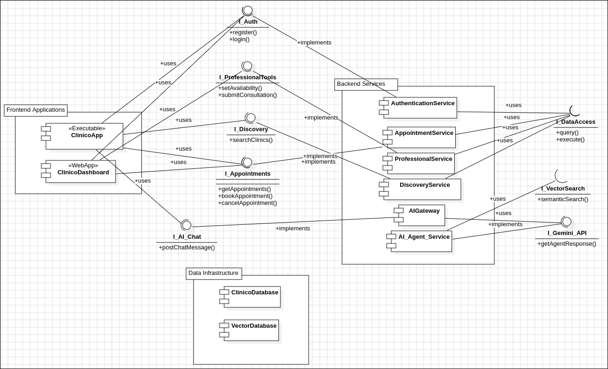
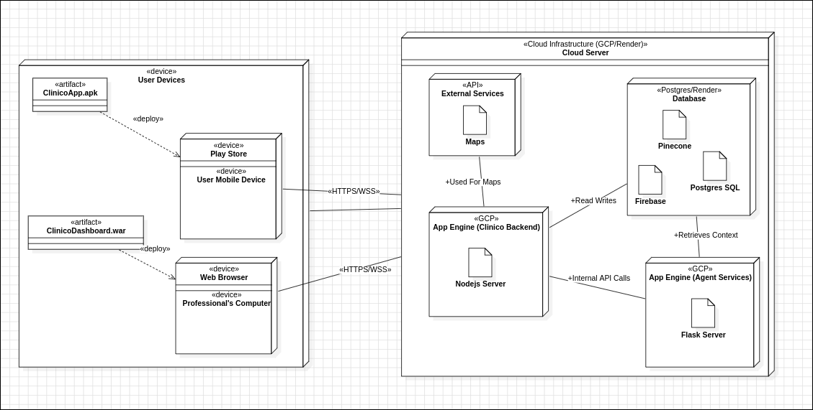

# Clinico System: Architectural Diagrams

This directory contains the high-level architectural diagrams for the **Clinico** project. These diagrams define the overall structure of the system, breaking it down into its major logical and physical components. They provide the "big picture" of how the application is organized and deployed.

---

## 1. Component Diagram

The Component Diagram illustrates the modular structure of the Clinico system, showing the major software components and the interfaces that govern their interactions. This design promotes a clean separation of concerns and a scalable, microservices-style architecture.

### Diagram

### Key Components:
*   **Frontend Applications:**
    *   `ClinicoApp`: The Flutter-based mobile application for patients.
    *   `ClinicoDashboard`: The React-based web dashboard for professionals.
*   **Backend Services:**
    *   A collection of specialized services (`AuthenticationService`, `AppointmentService`, etc.) that handle the core business logic.
    *   `AIGateway`: A dedicated service that acts as a secure orchestrator for the AI agents.
*   **Data Infrastructure:**
    *   `ClinicoDatabase`: The primary PostgreSQL database for all structured application data.
    *   `VectorDatabase`: The specialized database (e.g., Pinecone) that stores embeddings for the AI's knowledge base.
*   **Interfaces (`I_Auth`, `I_Appointments`, etc.):**
    *   These act as formal contracts between the frontend and backend, ensuring that the components are loosely coupled and can be developed and maintained independently.

### Explanation

### **1. Subsystems**

Subsystems are used to group related components.

-   **`<<subsystem>>` Frontend Applications**
    -   *Description:* Contains all user-facing client applications.
-   **`<<subsystem>>` Backend Services**
    -   *Description:* Contains the core server-side logic and orchestration.
-   **`<<subsystem>>` Data Infrastructure**
    -   *Description:* Contains the persistence and storage layers.

---

### **2. Components & Interfaces**

This section details each component and the interfaces they provide or require.

#### **Subsystem: `Frontend Applications`**

-   **Component:** `ClinicoApp`
    -   **`<<stereotype>>`** `Executable`
    -   **Description:** The Flutter-based mobile application for Patients and Users.
    -   **Provided Interfaces:** `User Interface`
    -   **Required Interfaces:** `I_Auth`, `I_AI_Chat`, `I_Appointments`, `I_Discovery`

-   **Component:** `ClinicoDashboard`
    -   **`<<stereotype>>`** `WebApp`
    -   **Description:** The React-based web dashboard for Professionals, NGOs, and Admins.
    -   **Provided Interfaces:** `Professional UI`
    -   **Required Interfaces:** `I_Auth`, `I_Appointments`, `I_ProfessionalTools`

#### **Subsystem: `Backend Services`**

-   **Component:** `AuthenticationService`
    -   **Description:** Manages user registration, login, and session tokens.
    -   **Provided Interfaces:** `I_Auth`
    -   **Ports:** `authPort` (provides `I_Auth`)

-   **Component:** `AppointmentService`
    -   **Description:** Handles all logic for booking, managing, and retrieving appointments.
    -   **Provided Interfaces:** `I_Appointments`
    -   **Ports:** `apptPort` (provides `I_Appointments`)

-   **Component:** `ProfessionalService`
    -   **Description:** Manages professional-specific actions like setting availability and submitting consultation notes.
    -   **Provided Interfaces:** `I_ProfessionalTools`
    -   **Ports:** `profPort` (provides `I_ProfessionalTools`)

-   **Component:** `DiscoveryService`
    -   **Description:** Manages searching and retrieving data for local clinics and doctors.
    -   **Provided Interfaces:** `I_Discovery`
    -   **Ports:** `discoveryPort` (provides `I_Discovery`)

-   **Component:** `AIGateway`
    -   **Description:** Acts as a secure gateway and orchestrator for the AI Care Companion.
    -   **Provided Interfaces:** `I_AI_Chat`
    -   **Ports:** `aiPort` (provides `I_AI_Chat`)
    -   **Required Interfaces:** `I_Gemini_API`

-   **Component:** `AI_Agent_Service`
    -   **`<<stereotype>>`** `Microservice`
    -   **Description:** The Python/Gemini service that contains the AI logic.
    -   **Provided Interfaces:** `I_Gemini_API`
    -   **Ports:** `geminiPort` (provides `I_Gemini_API`)

#### **Subsystem: `Data Infrastructure`**

-   **Component:** `ClinicoDatabase`
    -   **`<<stereotype>>`** `Database`
    -   **Description:** The PostgreSQL database that stores all relational data.
    -   **Provided Interfaces:** `I_DataAccess`

-   **Component:** `VectorDatabase`
    -   **`<<stereotype>>`** `Database`
    -   **Description:** The Pinecone (or similar) vector database for the RAG knowledge base.
    -   **Provided Interfaces:** `I_VectorSearch`

---

### **3. Interfaces**

These are the contracts that define how components communicate.

-   **Interface:** `I_Auth`
    -   **Operations:** `register()`, `login()`
-   **Interface:** `I_Appointments`
    -   **Operations:** `getAppointments()`, `bookAppointment()`, `cancelAppointment()`
-   **Interface:** `I_ProfessionalTools`
    -   **Operations:** `setAvailability()`, `submitConsultation()`
-   **Interface:** `I_Discovery`
    -   **Operations:** `searchClinics()`
-   **Interface:** `I_AI_Chat`
    -   **Operations:** `postChatMessage()`
-   **Interface:** `I_Gemini_API`
    -   **Operations:** `getAgentResponse()`
-   **Interface:** `I_DataAccess`
    -   **Operations:** `query()`, `execute()`
-   **Interface:** `I_VectorSearch`
    -   **Operations:** `semanticSearch()`

---

### **4. Connectors & Dependencies**

This section describes how to connect the components in the StarUML diagram.

-   **Interface Realization (implements):**
    -   `AuthenticationService` **--|>** `I_Auth`
    -   `AppointmentService` **--|>** `I_Appointments`
    -   `ProfessionalService` **--|>** `I_ProfessionalTools`
    -   `DiscoveryService` **--|>** `I_Discovery`
    -   `AIGateway` **--|>** `I_AI_Chat`
    -   `AI_Agent_Service` **--|>** `I_Gemini_API`
    -   `ClinicoDatabase` **--|>** `I_DataAccess`
    -   `VectorDatabase` **--|>** `I_VectorSearch`

-   **Dependency (uses):**
    -   `ClinicoApp` **..>** `I_Auth`, `I_AI_Chat`, `I_Appointments`, `I_Discovery`
    -   `ClinicoDashboard` **..>** `I_Auth`, `I_Appointments`, `I_ProfessionalTools`
    -   `AIGateway` **..>** `I_Gemini_API`
    -   `AuthenticationService`, `AppointmentService`, `ProfessionalService`, `DiscoveryService` **..>** `I_DataAccess`
    -   `AI_Agent_Service` **..>** `I_VectorSearch`

---

## 2. Deployment Diagram

The Deployment Diagram visualizes the physical and cloud-based topology of the system. It shows which hardware **nodes** the software **artifacts** are deployed on and how these nodes communicate over the network.

### Diagram

### Deployment Strategy:
*   **`User Devices` (Client-Side):**
    *   The **`ClinicoApp.apk`** artifact is deployed to a `User Mobile Device` (e.g., via the `Play Store`).
    *   The **`ClinicoDashboard.war`** (or equivalent JavaScript bundle) is deployed to a `Web Browser` on a `Professional's Computer`.
    *   All client devices communicate with the cloud server securely over **HTTPS/WSS**.

*   **`Cloud Server` (Server-Side on GCP/Render):**
    *   **`App Engine (Clinico Backend)`:** The core `Node.js Server` artifact is deployed here. It acts as the central orchestrator.
    *   **`App Engine (Agent Services)`:** The `Flask Server` artifact containing the Python-based AI logic is deployed as a separate service. The backend communicates with it via **Internal API Calls**.
    *   **`Database` Node:** This logical node contains two distinct, managed database services:
        *   **`Postgres SQL`** for primary application data.
        *   **`Pinecone`** (or another vector DB) for the AI's knowledge base.
    *   **`External Services`:** The backend also relies on external, managed APIs for specific functionalities like `Firebase` (for push notifications) and `Maps` (for geolocation).

### Explanation

#### **1. User Devices (Client-Side Environment)**

This block represents the hardware that the end-users directly interact with.

*   **Node: `User Mobile Device`**
    *   **Stereotype:** `<<device>>`
    *   **Description:** This represents a typical smartphone (Android or iOS) owned by a patient.
    *   **Nested Node:** It contains a `Play Store` (or App Store), representing the software environment from which the app is installed.
    *   **Deployed Artifact:** `<<artifact>> ClinicoApp.apk`. This is the compiled Flutter application, the actual software file that is installed and executed on the phone.

*   **Node: `Professional's Computer`**
    *   **Stereotype:** `<<device>>`
    *   **Description:** This represents a desktop or laptop computer used by a doctor, NGO partner, or administrator.
    *   **Nested Node:** `<<device>> Web Browser`. This is the execution environment inside the computer that runs the web application.
    *   **Deployed Artifact:** `<<artifact>> ClinicoDashboard.war`. This represents the compiled React web application files (JavaScript, CSS, HTML) that are sent from the server and executed by the browser.

#### **2. Cloud Server (Backend Environment)**

This block represents the entire server-side infrastructure, which is hosted on a cloud provider like **Google Cloud Platform (GCP)** or **Render**.

*   **Node: `App Engine (Clinico Backend)`**
    *   **Stereotype:** `<<GCP>>`
    *   **Description:** This is the primary server-side execution environment. It's responsible for the core business logic of the application.
    *   **Deployed Artifact:** `Nodejs Server`. This artifact contains all the backend code written in Node.js, including the API endpoints, user management, and appointment logic.

*   **Node: `App Engine (Agent Services)`**
    *   **Stereotype:** `<<GCP>>`
    *   **Description:** This is a separate, specialized execution environment dedicated solely to running the AI. This microservice approach separates the complex AI logic from the main backend, making the system more scalable and easier to maintain.
    *   **Deployed Artifact:** `Flask Server`. This artifact contains the Python code for the AI agents and the integration with the Google Gemini model.

*   **Node: `Database`**
    *   **Stereotype:** `<<Postgres/Render>>`
    *   **Description:** This node represents the managed database services that handle all data persistence.
    *   **Deployed Artifacts:**
        *   `Postgres SQL`: The primary relational database for storing structured data like user profiles, appointments, and consultations.
        *   `Pinecone`: The specialized vector database used to store the AI's knowledge base for the RAG (Retrieval-Augmented Generation) functionality.
        *   `Firebase`: While also an external service, it's grouped here as a data/messaging store for handling real-time push notifications.

*   **Node: `External Services`**
    *   **Stereotype:** `<<API>>`
    *   **Description:** This represents third-party, managed APIs that the Clinico backend relies on.
    *   **Deployed Artifact:** `Maps`. This represents the Google Maps API, which is used to provide geolocation and mapping data for the hyperlocal discovery feature.

#### **3. Communication Paths**

The arrows on the diagram show how these different nodes communicate:

*   **`User Devices` to `Cloud Server` (`<<HTTPS/WSS>>`)**: All communication from the mobile app and web browser to the backend is encrypted using **HTTPS** (for API calls) and **WSS** (Secure WebSockets for real-time chat/video). This is the main public-facing internet connection.

*   **`App Engine (Clinico Backend)` to `App Engine (Agent Services)` (`+Internal API Calls`)**: The Node.js backend communicates with the Python AI service over a secure, private internal network within the cloud. This communication is not exposed to the public internet, making it fast and secure.

*   **`App Engine (Clinico Backend)` to `Database` (`+Read/Writes`)**: The backend connects to both the PostgreSQL and Firebase databases to read and write application data.

*   **`App Engine (Agent Services)` to `Database` (`+Retrieves Context`)**: The AI service connects directly to the Pinecone vector database to retrieve context for its RAG responses.

*   **`App Engine (Clinico Backend)` to `External Services` (`+Used For Maps`)**: The backend makes API calls to the Google Maps service to fetch data needed for the discovery feature.