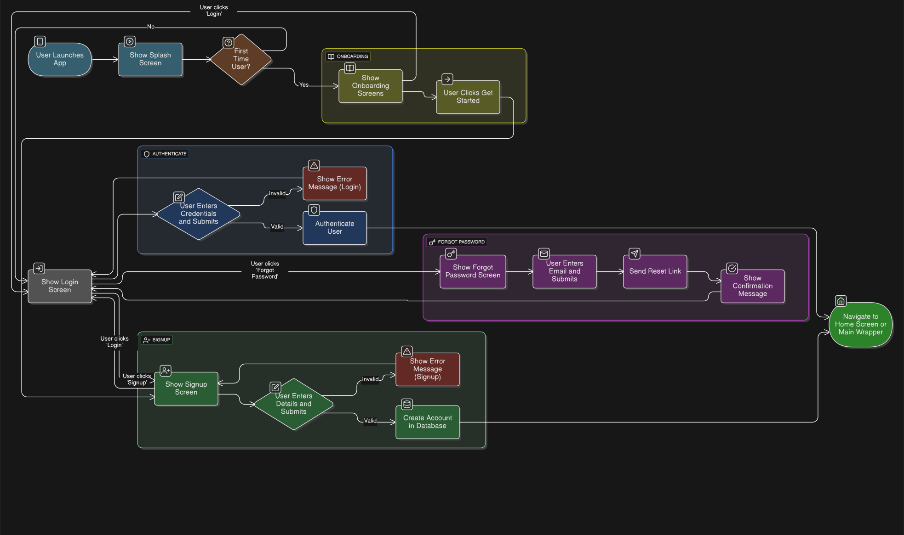
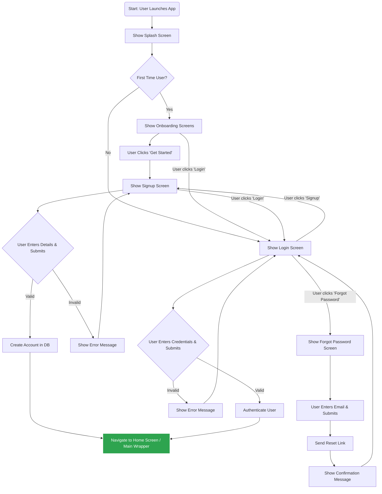
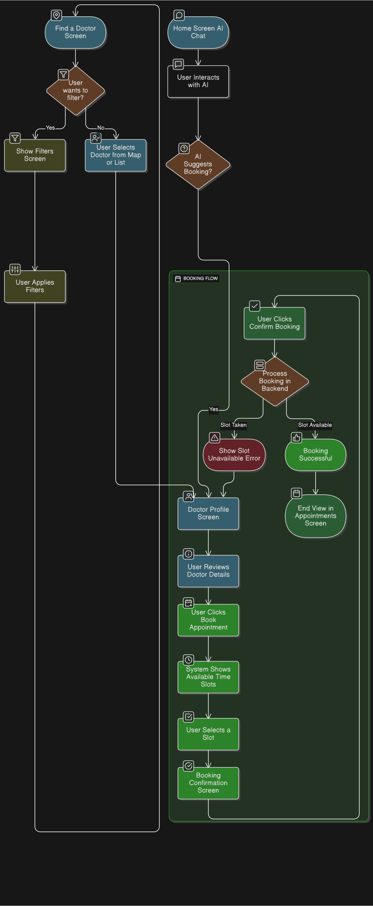
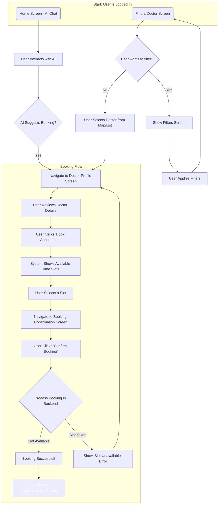
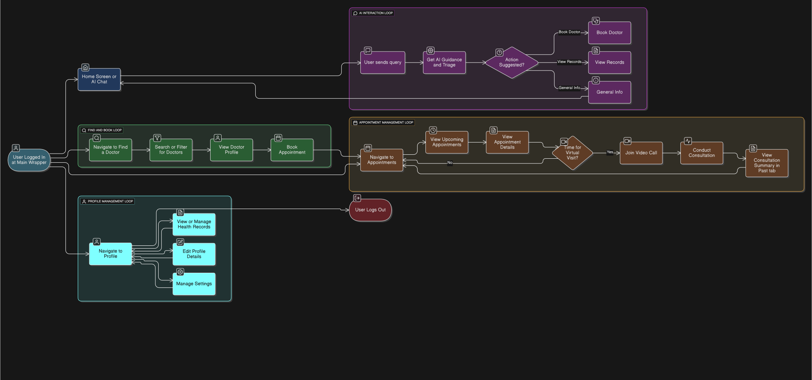
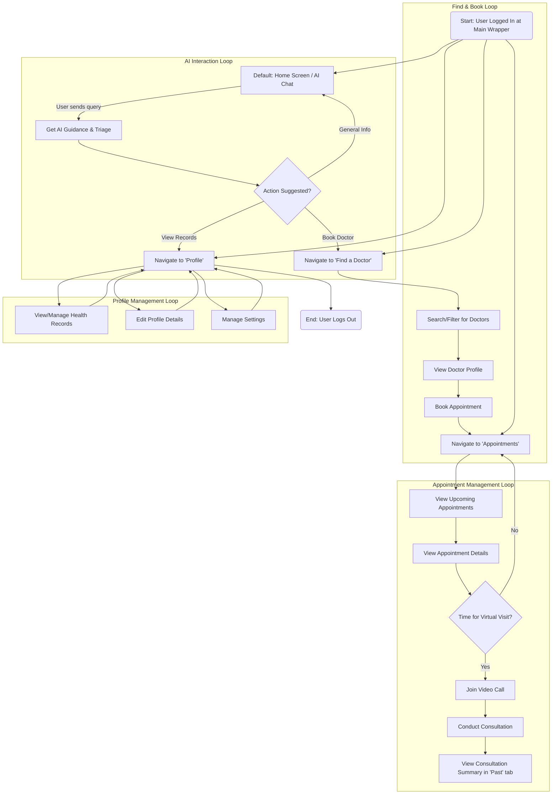

# Clinico Project: Process Flowcharts

This directory contains the detailed process flowcharts for the Clinico application. These diagrams visually map the step-by-step logic of key user journeys and system workflows, as defined during the requirement analysis phase.

Each flowchart is presented below, first as a visual diagram and then with the Mermaid code used to generate it.

---

## 1. User Onboarding & Login Flow

This flowchart details the entire user journey from launching the app for the first time to successfully registering a new account or logging in. It covers all decision points and paths in the authentication process.

### Diagram

### Mermaid Code

---

## 2. Appointment Booking Flow

This flowchart illustrates the complete workflow for booking an appointment. It covers the two main entry points for a user: starting from an AI suggestion or starting from a manual search on the "Find a Doctor" screen.

### Diagram

### Mermaid Code

---

## 3. Overall App Flow (Post-Login)

This high-level flowchart provides a complete overview of the application's user journey after a successful login. It shows how the user navigates between the four primary sections of the app: AI Chat, Find a Doctor, Appointments, and Profile.

### Diagram

### Mermaid Code
