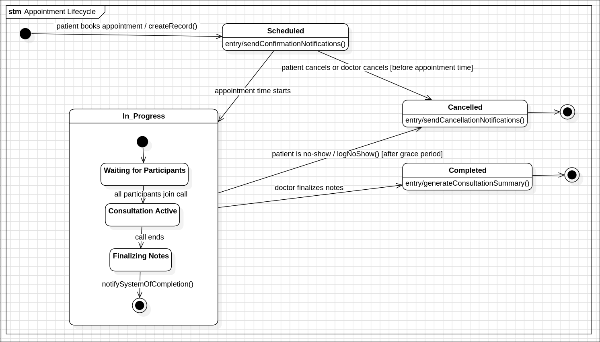

# Clinico System: Low-Level Design Diagrams

This directory contains the detailed, low-level design diagrams for the **Clinico** project. These diagrams serve as the direct blueprints for coding, illustrating the internal static structure and dynamic behavior of the software components.

---

## 1. Class Diagram

The Class Diagram is the primary blueprint for the object-oriented code. It defines all major classes, their attributes (data) and methods (functions), and the static relationships between them (inheritance, association, composition).

### Diagram

### Key Classes:
*   **`User`, `Patient`, `Professional`:** A core inheritance structure where `Patient` and `Professional` are specialized types of `User`.
*   **`Appointment`:** The central class that connects patients with professionals and is the subject of consultations.
*   **`AI_Agent_Controller`:** A class that encapsulates the logic for interacting with the AI, demonstrating a clear separation from the main application flow.

### Explanation

### **1. Enumerations (DataTypes)**

These define the custom data types used throughout the class model.

**Enumeration:** `UserRole`
-   **Literals:** `Patient`, `Professional`, `NGO`, `Admin`

**Enumeration:** `VerificationStatus`
-   **Literals:** `Pending`, `Verified`, `Rejected`

**Enumeration:** `AppointmentStatus`
-   **Literals:** `Scheduled`, `Completed`, `Cancelled`, `InProgress`

**Enumeration:** `AppointmentType`
-   **Literals:** `Virtual`, `In-Person`

---

### **2. Class Definitions**

#### **Class:** `User`
-   **Attributes:**
    -   `- userId : Integer`
    -   `- email : String`
    -   `- passwordHash : String`
    -   `# fullName : String`
    -   `# phoneNumber : String`
    -   `# role : UserRole`
-   **Operations:**
    -   `+ register(userData : Object) : AuthResponse`
    -   `+ login(credentials : Object) : AuthResponse`
    -   `+ logout() : void`
    -   `+ updateProfile(profileData : Object) : User`

#### **Class:** `Patient`
-   **Attributes:**
    -   `- patientId : Integer`
    -   `- dateOfBirth : Date`
    -   `- gender : String`
    -   `- address : String`
-   **Operations:**
    -   `+ bookAppointment(details : Object) : Appointment`
    -   `+ cancelAppointment(appointmentId : Integer) : Boolean`
    -   `+ viewAppointments(filter : String) : Appointment[]`
    -   `+ uploadMedicalRecord(file : File) : MedicalRecord`

#### **Class:** `Professional`
-   **Attributes:**
    -   `- professionalId : Integer`
    -   `# specialty : String`
    -   `# credentials : String`
    -   `# verificationStatus : VerificationStatus`
-   **Operations:**
    -   `+ setAvailability(slots : AvailabilitySlot[]) : Boolean`
    -   `+ viewSchedule() : Appointment[]`
    -   `+ startConsultation(appointmentId : Integer) : void`
    -   `+ endConsultation(consultation : Consultation) : Boolean`

#### **Class:** `Appointment`
-   **Attributes:**
    -   `- appointmentId : Integer`
    -   `- appointmentTime : DateTime`
    -   `- status : AppointmentStatus = Scheduled`
    -   `- type : AppointmentType`
    -   `- consultationLink : String`
-   **Operations:**
    -   `+ schedule() : void`
    -   `+ cancel() : void`
    -   `+ complete() : void`
    -   `+ start() : void`

#### **Class:** `Consultation`
-   **Attributes:**
    -   `- consultationId : Integer`
    -   `- notes : String`
    -   `- aiBriefing : String`
-   **Operations:**
    -   `+ saveNotes(notesText : String) : void`
    -   `+ createPrescription(medication : String, dosage : String) : Prescription`

#### **Class:** `Prescription`
-   **Attributes:**
    -   `- prescriptionId : Integer`
    -   `- medicationName : String`
    -   `- dosage : String`
    -   `- instructions : String`

#### **Class:** `MedicalRecord`
-   **Attributes:**
    -   `- recordId : Integer`
    -   `- documentName : String`
    -   `- documentUrl : String`

#### **Class:** `AI_Agent_Controller`
-   **Attributes:**
    -   `- geminiModel : GeminiPro`
    -   `- vectorDBClient : VectorDB`
-   **Operations:**
    -   `+ handleUserQuery(query : String, image : File) : AIResponse`
    -   `+ generateDoctorBriefing(patientId : Integer) : String`

#### **Class:** `Clinic`
-   **Attributes:**
    -   `- clinicId : Integer`
    -   `- name : String`
    -   `- address : String`
    -   `- type : String`
-   **Operations:**
    -   `+ addDoctor(doctorDetails : Object) : ClinicDoctor`
    -   `+ getDoctors() : ClinicDoctor[]`

#### **Class:** `ClinicDoctor`
-   **Attributes:**
    -   `- clinicDoctorId : Integer`
    -   `# fullName : String`
    -   `# specialty : String`
    -   `# consultationFee : Decimal`

#### **Class:** `AvailabilitySlot`
-   **Attributes:**
    -   `- slotId : Integer`
    -   `- startTime : DateTime`
    -   `- endTime : DateTime`
    -   `- isBooked : Boolean = false`
-   **Operations:**
    -   `+ book() : Boolean`

#### **Class:** `Review`
-   **Attributes:**
    -   `- reviewId : Integer`
    -   `- rating : Integer [1..5]`
    -   `- comment : String`

---

### **3. Relationships**

#### **Generalization**
-   **Description:** `Patient` and `Professional` are specialized types of `User`.
-   **Link:**
    -   `Patient` **--|>** `User`
    -   `Professional` **--|>** `User`

#### **Association**
-   **Description:** Defines the standard relationships and interactions between objects.
-   **Links:**
    -   `Patient "1" (client)` **--** `(books) "0..*"` `Appointment`
    -   `Professional "1" (virtualProvider)` **--** `(conducts) "0..*"` `Appointment`
    -   `ClinicDoctor "1" (inPersonProvider)` **--** `(conducts) "0..*"` `Appointment`
    -   `Patient "1" (author)` **--** `(writes) "0..*"` `Review`
    -   `Review "0..*"` **--** `(subject) "1"` `Appointment`
    -   `AI_Agent_Controller "1"` **--** `(interactsWith) "1"` `Patient`

#### **Aggregation**
-   **Description:** A "has-a" relationship where the part can exist independently of the whole.
-   **Link:**
    -   `Clinic "1" (whole)` **o--** `(employs) "1..*"` `ClinicDoctor`

#### **Composition**
-   **Description:** A strong "part-of" relationship where the part cannot exist without the whole.
-   **Links:**
    -   `Patient "1" (owner)` ******--** `(has) "0..*"` `MedicalRecord`
    -   `Professional "1" (owner)` ******--** `(sets) "0..*"` `AvailabilitySlot`
    -   `Appointment "1" (container)` ******--** `(results in) "0..1"` `Consultation`
    -   `Consultation "1" (container)` ******--** `(creates) "0..*"` `Prescription`

#### **Dependency**
-   **Description:** A "uses" relationship where a change in one class may affect another.
-   **Link:**
    -   `AI_Agent_Controller` **..>** `Professional` (client uses supplier to provide briefing) 

---

## 2. Object Diagram

The Object Diagram provides a "snapshot" of the system at a specific moment in time. This example shows a real-world scenario: *a patient, Abhay, has a scheduled virtual appointment with a doctor, Bhumika.* It is used to validate the logic and relationships defined in the Class Diagram.

### Diagram

### Explanation

#### **1. Objects**

**Object 1: `abhay_user: User`**
-   **Name Expression:** `abhay_user: User`
-   **Slots (`Ctrl+Enter`):**
    -   `fullName = "Abhay Raj"`
    -   `role = Patient`

**Object 2: `abhay_patient: Patient`**
-   **Name Expression:** `abhay_patient: Patient`
-   **Slot (`Ctrl+Enter`):**
    -   `patientId = 201`

**Object 3: `bhumika_user: User`**
-   **Name Expression:** `bhumika_user: User`
-   **Slots (`Ctrl+Enter`):**
    -   `fullName = "Dr. Bhumika"`
    -   `role = Professional`

**Object 4: `bhumika_prof: Professional`**
-   **Name Expression:** `bhumika_prof: Professional`
-   **Slots (`Ctrl+Enter`):**
    -   `professionalId = 301`
    -   `specialty = "Psychiatrist"`

**Object 5: `appointment_401: Appointment`**
-   **Name Expression:** `appointment_401: Appointment`
-   **Slots (`Ctrl+Enter`):**
    -   `status = Scheduled`
    -   `type = Virtual`
    -   `appointmentTime = "2025-11-15T14:00Z"`

#### **2. Links**

**Link 1: Between `abhay_user` and `abhay_patient`**
-   **To Create:** Select **Link** in the Toolbox. Drag from the `abhay_user` object and drop it on the `abhay_patient` object.

**Link 2: Between `bhumika_user` and `bhumika_prof`**
-   **To Create:** Select **Link** in the Toolbox. Drag from `bhumika_user` and drop on `bhumika_prof`.

**Link 3: From `abhay_patient` to `appointment_401`**
-   **To Create:** Select **Link** in the Toolbox. Drag from `abhay_patient` and drop on `appointment_401`.
-   **Add Label:** Double-click the link and add the label `+books` to describe the relationship.

**Link 4: From `bhumika_prof` to `appointment_401`**
-   **To Create:** Select **Link** in the Toolbox. Drag from `bhumika_prof` and drop on `appointment_401`.
-   **Add Label:** Double-click the link and add the label `+conducts` to describe the relationship.

---

## 3. Sequence Diagrams

Sequence Diagrams model the dynamic interactions between objects, showing the sequence of messages exchanged over time to complete a specific task or use case.

### a) Booking a Telehealth Appointment
This diagram shows the end-to-end flow of a user booking a virtual consultation, starting from their interaction with the AI, through the API calls, to the final database transaction.

### Explanation

#### **1. Lifelines**

-   **Lifeline 1:**
    -   **Name:** `: Patient`
    -   **Type:** `Actor`
-   **Lifeline 2:**
    -   **Name:** `: ClinicoApp`
    -   **Type:** `«Flutter»` (Set stereotype)
-   **Lifeline 3:**
    -   **Name:** `: Backend`
    -   **Type:** `«Node.js»` (Set stereotype)
-   **Lifeline 4:**
    -   **Name:** `: AIService`
    -   **Type:** `«Python/Gemini»` (Set stereotype)
-   **Lifeline 5:**
    -   **Name:** `: Database`
    -   **Type:** `«PostgreSQL»` (Set stereotype)

#### **2. Messages and Activations**

1.  **Message:** From `: Patient` to `: ClinicoApp`
    -   **Name:** `sends chat message("I need a psychiatrist")`
    -   **Type:** `Synch Call`
2.  **Message:** From `: ClinicoApp` to `: Backend`
    -   **Name:** `POST /api/ai/chat(message)`
    -   **Type:** `Synch Call`
3.  **Message:** From `: Backend` to `: AIService`
    -   **Name:** `forwardQuery(message)`
    -   **Type:** `Synch Call`
4.  **Message (Self):** On `: AIService`
    -   **Name:** `triageIntent()`
    -   **Type:** `Synch Call`
    -   **Add Note:** "AI determines intent is 'Book Appointment'"
5.  **Message:** From `: AIService` to `: Backend`
    -   **Name:** `structuredResponse(intent)`
    -   **Type:** `Reply Message`
6.  **Message:** From `: Backend` to `: ClinicoApp`
    -   **Name:** `AI Response (JSON)`
    -   **Type:** `Reply Message`
7.  **Message:** From `: ClinicoApp` to `: Patient`
    -   **Name:** `display AI message & suggestion`
    -   **Type:** `Reply Message`
8.  **Message:** From `: Patient` to `: ClinicoApp`
    -   **Name:** `clicks "Find a Doctor"`
    -   **Type:** `Synch Call`
9.  **Message:** From `: ClinicoApp` to `: Backend`
    -   **Name:** `GET /api/professionals?specialty=...`
    -   **Type:** `Synch Call`
10. **Message:** From `: Backend` to `: Database`
    -   **Name:** `SELECT * FROM Professionals`
    -   **Type:** `Synch Call`
11. **Message:** From `: Database` to `: Backend`
    -   **Name:** `doctorList`
    -   **Type:** `Reply Message`
12. **Message:** From `: Backend` to `: ClinicoApp`
    -   **Name:** `Doctor List (JSON)`
    -   **Type:** `Reply Message`
13. **Message:** From `: ClinicoApp` to `: Patient`
    -   **Name:** `display list of doctors`
    -   **Type:** `Reply Message`
14. **Message:** From `: Patient` to `: ClinicoApp`
    -   **Name:** `selects doctor and time slot`
    -   **Type:** `Synch Call`
15. **Message:** From `: ClinicoApp` to `: Backend`
    -   **Name:** `POST /api/appointments(bookingDetails)`
    -   **Type:** `Synch Call`

#### **3. Combined Fragment (opt)**

-   **`interactionOperator`:** Set to `opt` (Option).
-   **Guard (on the operand):** `[Slot is Available]`

**Inside the `opt` fragment:**

16. **Message:** From `: Backend` to `: Database`
    -   **Name:** `INSERT INTO Appointments`
    -   **Type:** `Synch Call`
17. **Message:** From `: Database` to `: Backend`
    -   **Name:** `Success`
    -   **Type:** `Reply Message`
18. **Message:** From `: Backend` to `: Database`
    -   **Name:** `UPDATE Availability_Slots`
    -   **Type:** `Synch Call`
19. **Message:** From `: Database` to `: Backend`
    -   **Name:** `Success`
    -   **Type:** `Reply Message`

#### **4. Continue Messages**

20. **Message:** From `: Backend` to `: ClinicoApp`
    -   **Name:** `201 Created (appointmentData)`
    -   **Type:** `Reply Message`
21. **Message:** From `: ClinicoApp` to `: Patient`
    -   **Name:** `show 'Booking Confirmed'`
    -   **Type:** `Reply Message`

---

### b) Completing a Consultation
This diagram details the interaction from the doctor's perspective as they finalize a call, write clinical notes, and create prescriptions via the web dashboard.

### Explanation

#### **1. Lifelines**

-   **Lifeline 1:**
    -   **Name:** `: Doctor`
    -   **Type:** `Actor`
-   **Lifeline 2:**
    -   **Name:** `: ClinicoDashboard`
    -   **Type:** `«React WebApp»` (Set stereotype)
-   **Lifeline 3:**
    -   **Name:** `: Backend`
    -   **Type:** `«Node.js»` (Set stereotype)
-   **Lifeline 4:**
    -   **Name:** `: Database`
    -   **Type:** `«PostgreSQL»` (Set stereotype)

#### **2. Messages and Activations**

1.  **Message (Self):** On `: Doctor`
    -   **Name:** `Enters notes & prescription details in UI form`
    -   **Note:** This is an action by the actor, represented as a comment or a self-message without a reply.
2.  **Message:** From `: Doctor` to `: ClinicoDashboard`
    -   **Name:** `clicks "Save & Finalize Notes"`
    -   **Type:** `Synch Call`
3.  **Message:** From `: ClinicoDashboard` to `: Backend`
    -   **Name:** `POST /api/consultations(consultationData)`
    -   **Type:** `Synch Call`
4.  **Message (Self):** On `: Backend`
    -   **Name:** `validate(appointmentId, doctorId)`
    -   **Type:** `Synch Call`
    -   **Note:** "Ensures the doctor owns this appointment."
5.  **Message:** From `: Backend` to `: Database`
    -   **Name:** `INSERT INTO Consultations(notes, aiBriefing, ...)`
    -   **Type:** `Synch Call`
6.  **Message:** From `: Database` to `: Backend`
    -   **Name:** `newConsultationId`
    -   **Type:** `Reply Message`

#### **3. Combined Fragment (loop)**

-   **`interactionOperator`:** Set to `loop`.
-   **Guard (on the operand):** `[for each prescription in consultationData]`

**Inside the `loop` fragment:**

7.  **Message:** From `: Backend` to `: Database`
    -   **Name:** `INSERT INTO Prescriptions(consultationId, ...)`
    -   **Type:** `Synch Call`
8.  **Message:** From `: Database` to `: Backend`
    -   **Name:** `Success`
    -   **Type:** `Reply Message`

#### **4. Continue Messages**

9.  **Message:** From `: Backend` to `: Database`
    -   **Name:** `UPDATE Appointments SET status='Completed'`
    -   **Type:** `Synch Call`
10. **Message:** From `: Database` to `: Backend`
    -   **Name:** `Success`
    -   **Type:** `Reply Message`
11. **Message:** From `: Backend` to `: ClinicoDashboard`
    -   **Name:** `201 Created`
    -   **Type:** `Reply Message`
12. **Message:** From `: ClinicoDashboard` to `: Doctor`
    -   **Name:** `show 'Consultation Saved' & Redirect`
    -   **Type:** `Reply Message`

---

## 4. Activity Diagram

The Activity Diagram details the workflow of a complex operation, illustrating the flow of control between various activities and decisions. This example models the sophisticated triage process managed by the AI Care Companion.

### Diagram

### Key Paths:
*   **`General Health Question`:** Shows the RAG (Retrieval-Augmented Generation) flow where the AI queries the knowledge base.
*   **`Mental Wellness Distress`:** Details the path for empathetic response and crisis detection.
*   **`Request to Book`:** Illustrates how the AI guides the user toward the appointment booking flow.

### Explanation

#### **1. Swimlanes**

-   **Swimlanes:**
    -   Three vertical swimlanes on the diagram.
    -   **Name :** `Patient`, `Clinico AI System`, and `External Systems`.

#### **2. Nodes and Actions within Swimlanes**

##### **In the `Patient` Swimlane:**

1.  **Initial Node:**
    -   **To Create:** Select **Initial** in the Toolbox and place it at the top.
2.  **Action:** `Sends Message to AI`
    -   **To Create:** Select **Action** in the Toolbox and place it below the Initial Node.
3.  **Action:** `Receives AI Response & Guidance`
4.  **Activity Final Node:**
    -   **To Create:** Select **Final** in the Toolbox and place it at the bottom.

##### **In the `Clinico AI System` Swimlane:**

1.  **Action:** `Analyze User Intent`
    -   This is the first action in this lane.
2.  **Decision Node (Diamond Shape):**
3.  **Action:** `Retrieve Context from Knowledge Base (RAG)`
4.  **Action:** `Generate Grounded, Informative Answer`
5.  **Merge Node (Diamond Shape):**
6.  **Decision Node (Diamond Shape):**
    -   **Name:** `Crisis Keywords?`
7.  **Action:** `Provide Immediate Helpline Info`
8.  **Action:** `Generate Empathetic Response`
9.  **Action:** `Offer Guided Self-Help or Professional Help`
10. **Action:** `Identify Specialty & Location Need`
11. **Decision Node (Diamond Shape):**
    -   **Name:** `Virtual or In-Person?`
12. **Action:** `Suggest Telehealth Professionals`
13. **Action:** `Guide to Appointment Booking Flow`
14. **Action:** `Suggest Search on Hyperlocal Map`
15. **Action:** `Ask Clarifying Questions`

##### **In the `External Systems` Swimlane:**

1.  **Datastore:** `Knowledge Base (Vector DB)`
    -   This represents the Pinecone/Vertex AI database.

#### **3. Control and Object Flows**

1.  **Control Flow** from `Initial Node` to `Sends Message to AI`.
2.  **Object Flow** from `Sends Message to AI` to `Analyze User Intent`.
    -   **Label:** `[User Query]`
3.  **Control Flow** from `Analyze User Intent` to the first `Decision Node`.
4.  **Control Flow** from the `Decision Node` to `Retrieve Context from Knowledge Base (RAG)`.
    -   **Guard:** `[General Health Question]`
5.  **Object Flow** from `Knowledge Base (Vector DB)` Datastore to `Retrieve Context`.
    -   **Label:** `[Context Chunks]`
6.  **Control Flow** from `Retrieve Context` to `Generate Grounded, Informative Answer`.
7.  **Control Flow** from `Generate Grounded Answer` to the `Merge Node`.
8.  **Control Flow** from the `Decision Node` to the `Crisis Keywords?` Decision Node.
    -   **Guard:** `[Mental Wellness Distress]`
9.  **Control Flow** from `Crisis Keywords?` to `Provide Immediate Helpline Info`.
    -   **Guard:** `[Yes, Crisis Detected]`
10. **Control Flow** from `Crisis Keywords?` to `Generate Empathetic Response`.
    -   **Guard:** `[No Crisis]`
11. **Control Flow** from `Generate Empathetic Response` to `Offer Guided Self-Help or Professional Help`.
12. **Control Flow** from `Provide Immediate Helpline Info` to the `Merge Node`.
13. **Control Flow** from `Offer Guided Self-Help` to the `Merge Node`.
14. **Control Flow** from the first `Decision Node` to `Identify Specialty & Location Need`.
    -   **Guard:** `[Request to Book / Find Doctor]`
15. **Control Flow** from `Identify Specialty` to the `Virtual or In-Person?` Decision Node.
16. **Control Flow** from `Virtual or In-Person?` to `Suggest Telehealth Professionals`.
    -   **Guard:** `[Virtual]`
17. **Control Flow** from `Suggest Telehealth` to `Guide to Appointment Booking Flow`.
18. **Control Flow** from `Guide to Booking` to the `Merge Node`.
19. **Control Flow** from `Virtual or In-Person?` to `Suggest Search on Hyperlocal Map`.
    -   **Guard:** `[In-Person]`
20. **Control Flow** from `Suggest Search on Map` to the `Merge Node`.
21. **Control Flow** from the first `Decision Node` to `Ask Clarifying Questions`.
    -   **Guard:** `[Unclear Intent]`
22. **Control Flow** from `Ask Clarifying Questions` back to `Analyze User Intent`.
23. **Object Flow** from the `Merge Node` to `Receives AI Response & Guidance`.
    -   **Label:** `[Structured Response]`
24. **Control Flow** from `Receives AI Response` to the `Activity Final Node`.

---

## 5. State-chart Diagram

The State-chart Diagram models the complete lifecycle of a single, important object. This diagram shows the different states an `Appointment` object can be in (e.g., `Scheduled`, `In_Progress`, `Completed`, `Cancelled`) and the events (triggers) that cause it to transition from one state to another.

### Diagram

### Explanation

#### **1. States**

1.  **Initial State:**
2.  **Simple State:** `Scheduled`
3.  **Composite State:** `In_Progress`
4.  **Simple State:** `Completed`
5.  **Simple State:** `Cancelled`
6.  **Final State:**

#### **2. The `In_Progress` Composite State**

A virtual consultation isn't a single action; it's a process. We model this inside the `In_Progress` state.

1.  **In_Progress region,:**
    -   An **Initial State**.
    -   A **Simple State** named `Waiting for Participants`.
    -   A **Simple State** named `Consultation Active`.
    -   A **Simple State** named `Finalizing Notes`.
    -   A **Final State**.

#### **3. Transitions and Triggers**

##### **Main State Transitions:**

1.  **From `Initial State` to `Scheduled`:**
    -   **Trigger/Effect:** `patient books appointment / createRecord()`
2.  **From `Scheduled` to `In_Progress`:**
    -   **Trigger:** `appointment time starts`
3.  **From `Scheduled` to `Cancelled`:**
    -   **Trigger:** `patient cancels` or `doctor cancels`
    -   **Guard:** `[before appointment time]`
4.  **From `In_Progress` to `Cancelled`:**
    -   **Trigger:** `patient is no-show`
    -   **Guard:** `[after grace period]`
    -   **Effect:** `logNoShow()`
5.  **From `In_Progress` to `Completed`:**
    -   **Trigger:** `doctor finalizes notes`
6.  **From `Cancelled` to its `Final State`:**
    -   *No label needed.*
7.  **From `Completed` to its `Final State`:**
    -   *No label needed.*

##### **Transitions within the `In_Progress` State:**

1.  **From `Initial State` (inside `In_Progress`) to `Waiting for Participants`:**
    -   *No label needed.*
2.  **From `Waiting for Participants` to `Consultation Active`:**
    -   **Trigger:** `all participants join call`
3.  **From `Consultation Active` to `Finalizing Notes`:**
    -   **Trigger:** `call ends`
4.  **From `Finalizing Notes` to the `Final State` (inside `In_Progress`):**
    -   **Effect:** `notifySystemOfCompletion()`
    -   **Note:** The main transition from `In_Progress` to `Completed` is triggered externally by the doctor's save action, but this internal final state signifies the end of the "In_Progress" sub-activities.

#### **4. Add Internal Activities (Entry/Exit)**

-   **Select the `Scheduled` state:**
    -   In the menu, go to `Model | Add | Entry Activity`.
    -   **Name the activity:** `entry / sendConfirmationNotifications()`
-   **Select the `Completed` state:**
    -   In the menu, go to `Model | Add | Entry Activity`.
    -   **Name the activity:** `entry / generateConsultationSummary()`
-   **Select the `Cancelled` state:**
    -   In the menu, go to `Model | Add | Entry Activity`.
    -   **Name the activity:** `entry / sendCancellationNotifications()`