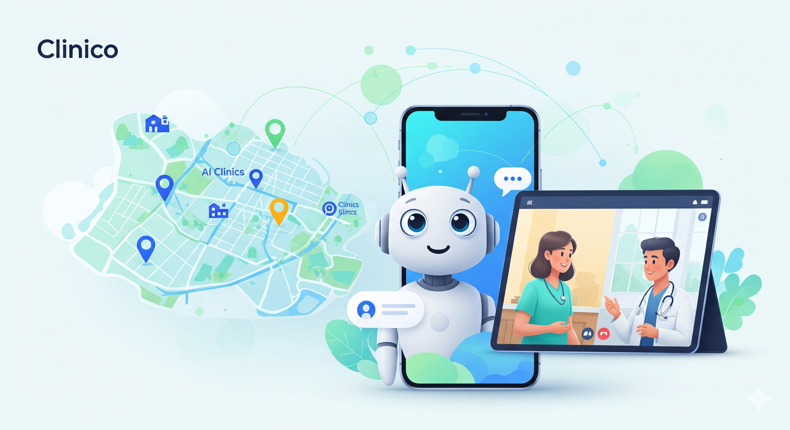

# Clinico: The Healing Hand Initiative  

This repository contains the ideation, research, and planning documents for Clinico, a proposed B.Tech Minor Project. Our goal is to design a smart, hybrid platform to bridge the healthcare gap in underserved communities.

A B.Tech Minor Project aimed at bridging the healthcare gap in underserved communities through a smart, hybrid platform, combining an AI-powered guide with real-time virtual and local healthcare services.

---

## 🎯 Problem Statement

Access to quality healthcare remains a critical challenge, especially in underserved regions. The key problems we identified are:

*   **📍 Rural Healthcare Deserts:** A severe shortage of doctors and specialists in rural areas forces patients to travel long distances for basic care.
*   **🧠 Mental Health Gap:** A massive deficit of mental health professionals makes timely care for mental wellness nearly impossible for most.
*   **💰 High Costs & Confusion:** Patients often face high out-of-pocket costs and struggle to find the right, verified doctor for their needs.
*   ** fragmented System:** Care is disconnected. There is no single platform that can guide a user from a simple query to a virtual consultation or a local clinic visit.

---

## 💡 Our Solution

Clinico is a mobile-first, hybrid healthcare ecosystem designed to address these challenges head-on. Our platform provides a seamless user journey through three core pillars:

1.  **AI Care Companion:** An intelligent chatbot that acts as the first point of contact, offering 24/7 support, answering health queries with verified information, and guiding users to the right care pathway.
2.  **Virtual Telehealth:** A secure platform connecting patients with a network of volunteer doctors and mental health professionals for remote consultations via video, audio, or chat.
3.  **Hyperlocal Discovery:** An interactive map that helps users find, compare, and book appointments with verified local clinics and hospitals based on specialty, rating, and fees.

---

## ✨ Key Features

*   **🤖 AI Care Companion:** 24/7 AI-powered chat for instant answers to health queries and intelligent navigation.
*   **🧑‍⚕️ Telehealth Consultations:** Secure video & audio calls with verified volunteer doctors.
*   **🗺️ Hyperlocal Doctor Discovery:** An interactive map to find and filter local clinics and hospitals.
*   **📋 Unified Health Records:** A single, secure place for users to manage their prescriptions and medical history.
*   **🤝 NGO & Community Portal:** A web dashboard for partner NGOs to help facilitate care for community members.
*   **🔒 Secure Authentication:** A complete user login and registration system.

---

## 🛠️ Tech Stack

*   **Frontend (Mobile & Web):**  
      
*   **Backend & Real-time Communication:**  
       
*   **Database:**  
    
*   **AI & Machine Learning:**  
     

---

## 👨‍💻 Project Created By

This project was developed by a team of dedicated students from the Department of IT.

| Name | University Enroll. No | Role |
| :--- | :--- | :--- |
| **Abhay Raj** | `00976803122` | Group Leader |
| **Alok Ranjan** | `15276803122` | Member |
| **Bhumika Choudhary** | `15376803122` | Member |
| **Tejaswini Singh** | `16576803122` | Member |