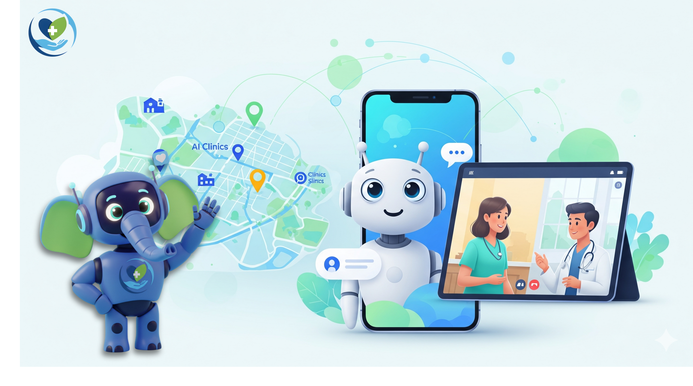

# Clinico: The Healing Hand Initiative

  
  
  

**Clinico** is a B.Tech Minor Project aimed at bridging the healthcare gap through a smart, hybrid platform. It combines an **AI Care Companion** with **Virtual Telehealth** and **Hyperlocal Doctor Discovery** to make quality healthcare accessible and affordable for underserved communities.

---

## 🚀 Key Features

*   **🤖 AI Care Companion:** 24/7 AI-powered chat for instant, trusted health guidance.
*   **🧑‍⚕️ Telehealth Consultations:** Secure video & audio calls with a network of volunteer doctors.
*   **🗺️ Hyperlocal Discovery:** An interactive map to find and filter verified local clinics and hospitals.
*   **📋 Unified Health Records:** A secure vault for users to manage their prescriptions and medical history.
*   **🤝 NGO & Community Portal:** A dedicated web dashboard for partner NGOs to facilitate care.

---

## 🎨 Design & Documentation

Our project is built on a foundation of detailed planning and user-centric design. You can explore our complete design and documentation via the links below.

| Artifact | Link | Description |
| :--- | :--- | :--- |
| **UI/UX Design (Figma)** | **[View Figma File](https://www.figma.com/design/JjQDb3WsjIu8fVEotirqMk/CLINICO---UI-UX)** | The complete, high-fidelity mockups for both the mobile app and the web dashboard. |
| **SRS Document** | **[Read the SRS](./documentation/SRS.md)** | The Software Requirements Specification, detailing all functional and non-functional requirements. |
| **SDD Document** | **[Read the SDD](./documentation/SDD.md)** | The Software Design Document, outlining the system's architecture and low-level design. |
| **API Documentation** | **[View API Docs](./documentation/api/README.md)** | A comprehensive guide to all backend API endpoints for frontend developers. |

---

### Meet Our Mascot!

Our friendly AI Care Companion is represented by our custom-designed mascot, ready to guide users on their health journey.

  

---

## 🛠️ Technology Stack

This project leverages a modern, scalable, and robust technology stack.

*   **Frontend (Mobile App):**  
    
*   **Frontend (Web Dashboard):**  
    
*   **Backend & APIs:**  
     
*   **AI Service & Engine:**  
      
*   **Database:**  
     
*   **Infrastructure & Deployment:**  
     

---

## 🗺️ Project Roadmap & Progress

We are managing our project lifecycle using GitHub Issues and Projects. You can track our progress live via our project board.

-   [**View Project Board**](https://github.com/users/abhay-byte/projects/1)

-   [x] **Phase 1: Requirement Engineering & Planning**
-   [x] **Phase 2: Software Design (High & Low-Level)**
-   [ ] **Phase 3: Coding & Implementation** *(In Progress)*
-   [ ] **Phase 4: Testing & Quality Assurance**
-   [ ] **Phase 5: Deployment & Final Documentation**

---

## 👨‍💻 Project Team

This project is being developed by a dedicated team of students from the Department of IT.

| Name | University Enroll. No | Role |
| :--- | :--- | :--- |
| **Abhay Raj** | `00976803122` | Group Leader |
| **Alok Ranjan** | `15276803122` | Member |
| **Bhumika Choudhary**| `15376803122` | Member |
| **Tejaswini Singh** | `16576803122` | Member |
